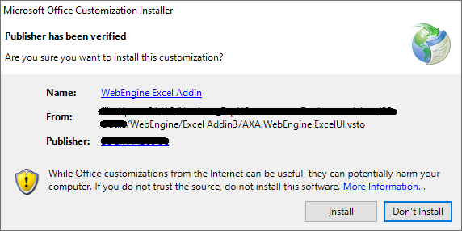
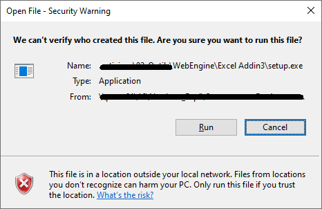
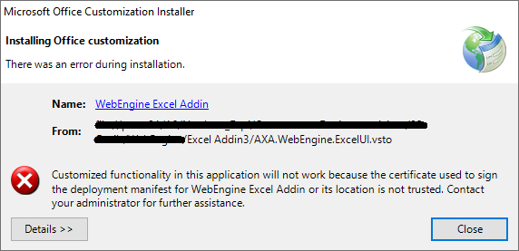
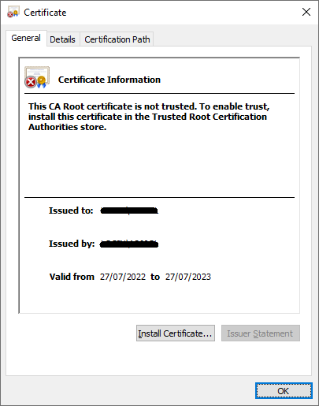
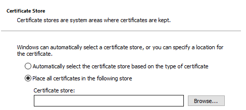
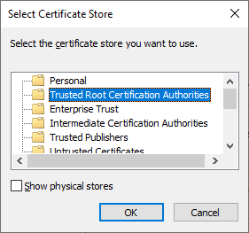
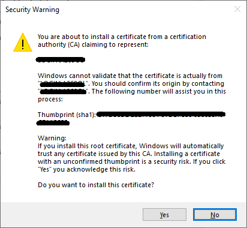

# Install WebEngine Add-in for Excel

## How to install WebEngine Add-in
* Download Excel add-in from [Here](http://download_link.)
* Close all Excel instances
* Launch `Setup.exe`

* Then click install to finish installation
* Open Excel and now you can see WebEngine add-in showing in the ribbons.

## Potential problems during installation.
### I receive a security warning

If you are installing from a shared location, you may encounter this warning. Just click on run to continue the installation.

### The installation is forbidden because signature certificate is not trusted.

If your organization forbids installation of unsigned Office Add-in, you'll need to:
* Compile Excel add-in from source code and sign it with your organization's certificate.
* Install the default certificate in trusted store

### Install default certificate
If you choose not the compile and sign yourself the Excel Add-in, you can trust install the default certificate.

Objectives:
- Install certificate in `Trusted Root Certification Authorities` store
- Install certificate in `Trusted Publishers` store

To do it, following this procedure
1. Open `Excel_certificate.cer` provided in the Add-in Package

2. Click `Install Certificate` and choose `Current User`

3. Choose `Place all certificates in the following store` and click on `Browse`

4. Select `Trusted Root Certification Authorities` and click `OK`

5. If the warning dialog shows like follow, accept it.

6. Repeat the same procedure to install the same certificate in the store `Trusted Publisher`

After installation of the certificate, you should be able to install the WebEngine Add-in for Excel.
