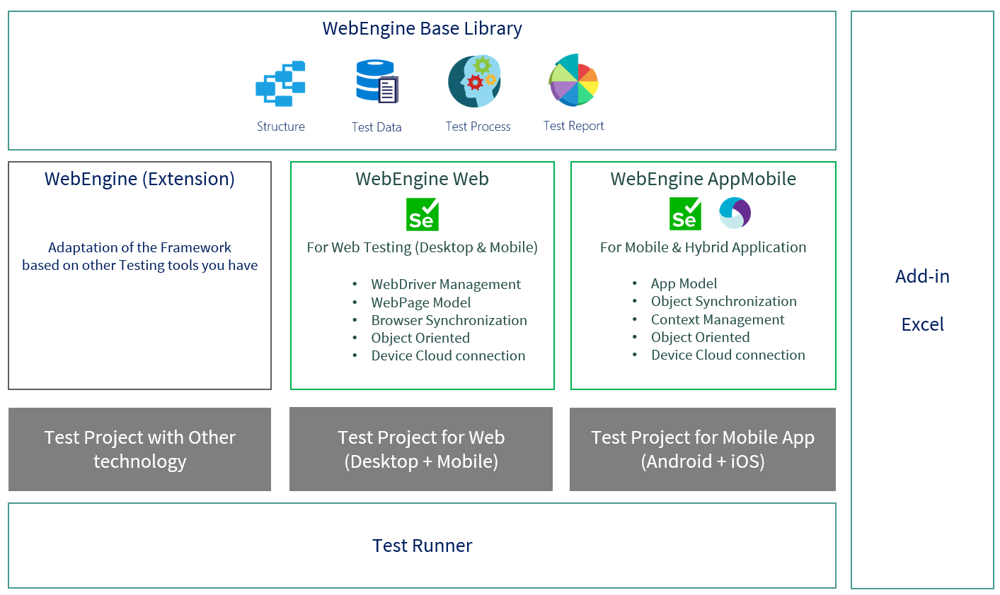

# Introduction of WebEngine Framework

WebEngine Test Framework is a framework for Web and Mobile based applications.
The framework is built on top of base solutions like Selenium, Appium. But it can also be extended using other underlying technologies.
It provides standardized approaches and built-in practices and Tool sets to run and review tests.

These tests can be run locally, remotely, or be integrated in a Continuous Integration Platform.

## Overview
Following is a schemas of WebEngine Framework architecture. It is mainly composed with 6 components.

* `WebEngine Base Library`: The base class library defines basic data structures for Reusable Actions, Test Cases, Test Suites, Test data, Environment Variables and Test Report.
* `WebEngine Web`: The class library that handles Selenium WebDriver, Web Element Identification, Page Models, and all you need to develop test solution for Web Applications on both Desktop and Mobile browsers.
* `WebEngine MobileApp`: The class library that handles Appium WebDriver, App Element Identification and Device Connection to help developing test solutions for Android and iOS applications.
* `Excel Add-in`: To adopt Data-Driven test approach, you can work with EXCEL and use `Excel Add-in` to easily manage, export and launch test execution directly from EXCEL.
* `Test Runner`: The main executable component to run your automated test with given configuration. It generates a rich XML based report which can be viewed with ReportViewer.
* `Report Viewer`: This tool shows test report in a graphic way. Gives you both synthetic and details view.

## Installation
According to your test approaches and technology, you can install one or more libraries. for example:

### Keyword-Driven Approach for Web Application
To build test automation solution with keyword driven approach, you will need:
* **WebEngine Base Library** as base class
* **WebEngine Web** to benefits WebDriver management, WebElement Identification and Page Models.
* and **Test Runner** for test Execution

### Writing Unit Tests for iOS App
To build Test automation solution using any Unit Test Framework (NUnit or JUnit for example), you'll need:
* **WebEngine Base Library** as base class
* **WebEngine MobileApp** to benefits AppiumDriver management, AppElement Identification, Page Models and App Package uploading.
* You don't need Test Runner as test execution is managed by the Unit Test Framework you have selected.

### Writing Gherkin Scenarios for Web Application
* **WebEngine Base Library** as base class
* **WebEngine Web** to benefits WebDriver management, WebElement Identification and Page Models.
* You don't need Test Runner as the Test execution is managed by the Cucumber/SpecFlow Framework you have selected.

## Extension
If you are working with other technologies other than Selenium, it is possible to build an extension based on `WebEngine Base Library`.
That gives you the possibility to build test solution with the same approach with different tools. 

For example, some of teams in AXA use *MicroFocus UFT Developer*, and We have an WebEngine UFT Developer extension.
