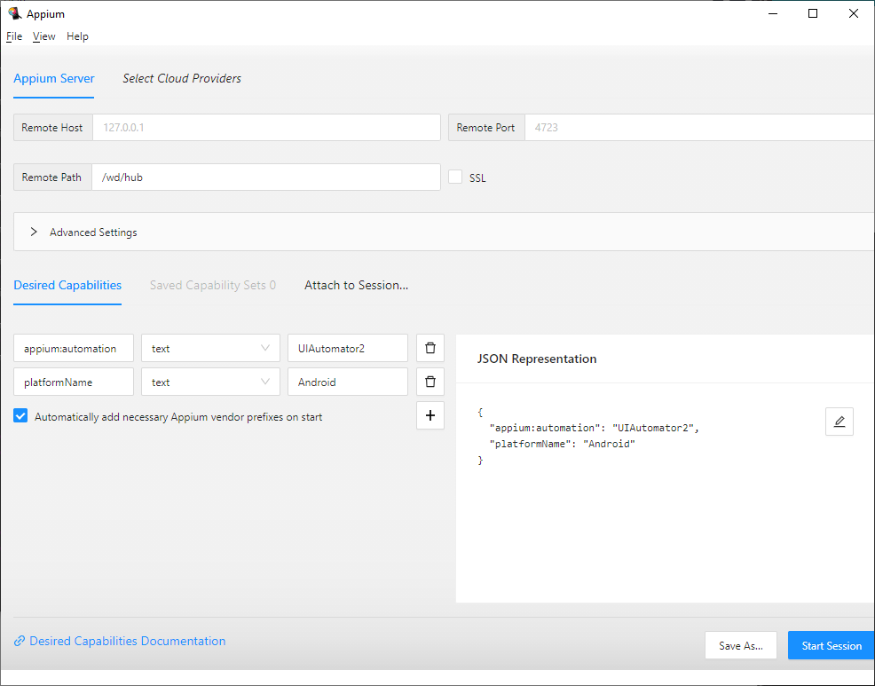

# Identify Mobile App UI Elements

During the automation activities, you’ll need to identify elements used by the application.
For Web based testing you can observe HTML/DOM elements via developer tool provided by browsers, but for mobile App testing, you’ll need following tools:

* `Appium Inspector`: An Appium client of which you can observe the application and its UI elements.
* `Appium Server`: provides the interface to connect to a mobile device or emulator.
* `Device`: The emulator or the real devices (connected via USB through the hosting machine), where mobile application is running.

The following example is based on Android Emulator, for other configuration, please refer to Appium Documentation

## Appium server 


Download and install Appium GUI server and start it. you can also install Appium server via `npm`.
please refer to the documentation of Appium http://appium.io/

## Appium Inspector
Then install and start Appium inspector, with following configuration:



* `Remote Path`: /wd/hub
* `Desired Capabilities`
    - `appium:automation`: UIAutomator2
    - `platformName`: Android

This configuration helps you to connect to a local Appium server `http://localhost:4723/wd/hub`

> [!NOTE]
> You can also connect Appium inspector to your cloud provider. 
> In this case, please refer to service provider's website and provide necessary capabilities.

## Observe the application
Appium inspector looks like the following image:


You can select element from the screenshot or locate it in App Source. On the right side, there will be a panel which helps you to choose a valid selector, such as `id` or `xpath`

In this example, we have selected the digit 5 of the calculator app. And according to the recommendation from right panel, we can use the selector `id`

Now you can declare this element by using <xref:AXA.WebEngine.MobileApp.AppElementDescription>, and access to its methods, like `Click()`
```csharp
var digit5 = new AppElementDescription(driver){
    Id = "com.Android.calculator2:id/digit_5"
}

digit5.Click()
```

Like web applications, you can organize all UI elements of the same page into <xref:AXA.WebEngine.Web.PageModel>. For example, this class defines some digit buttons, equals, multiply of the calculator app.
```csharp
public class CalculatorPage : PageModel
{
    public AppElementDescription Digit0 = new AppElementDescription
    {
        Id = "com.Android.calculator2:id/digit_0"
    };

    public AppElementDescription Equals = new AppElementDescription
    {
        Id = "com.Android.calculator2:id/eq"
    };

    public AppElementDescription Multiply = new AppElementDescription
    {
        ClassName = "Android.widget.Button",
        AccessbilityId = "multiply"
    };

    public CalculatorPage(WebDriver driver) : base(driver)
    {
    }
}
```
You can use one or multiple selectors to locate an UI element:
* `AccessibilityId`: the `accessibility id` property
* `ClassName`: the `class` property
* `Id`: The `id` property
* `XPath`: The xpath property
* `Text`: The text property
* `Content-Description`: The `content-desc` property

For specific device, you can also use:
* `UIAutomatorSelector`: a native selector using UIAutomator on the Android.
* `IosClassChain`: a native selector provided by iOS device.

The above two selectors can only be used individually, when they are provided all other selectors will be ignored.


