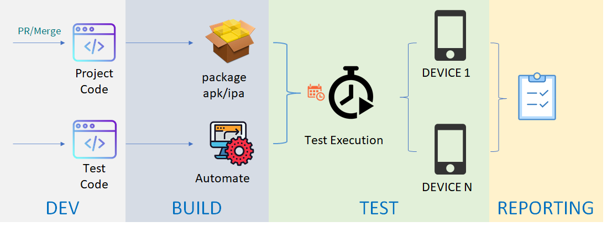

# Integrate your tests into a DevOps environment

When your team is working with Agile methodology, Test automation is essential and beneficial. In this article we discuss how to integrate your Test automation solution into an DevOps environment.

## Procedures of DevOps Integration
For following schemas describes how in AXA we test mobile applications. the schemas of Web application are very similar.

The Dev team use Git repository to collaborate on code, Use DevOps platform to compile solutions, run unit tests and generate application packages.

The Test team also use Git repository to manage the versioning of test scripts and use DevOps platform to execute test on selected devices (or browsers), then integrate test report in the test management system.

The procedure is triggered each time an application package is successfully generated.

### Define the test pipeline
Taken Azure DevOps for example, this is what a Android test pipeline looks like:

The pipeline is triggered when an Android package is generated by another build pipeline (which itself is triggered by a Pull Request or Merge). Then it brings the package (named `_Android`) and a specific version of the test script (named `_test`).

The pipeline will launch several stages in parallel. On each stage launch the same test suite on selected devices, that is:
 * Upload package to device cloud provider
 * Execute the test script on selected device
 * Generate test results
 * And integrate test results into Test Management System

 ### Conclusion
 With the DevOps platform integration, automated tests are launched automatically on selected devices each time a developer has done a Pull Request or a Merge. The feedback of software quality is very fast.

 On other DevOps platforms such as GitHub Actions or Jenkins, the implementation may vary, but the idea is the same.
