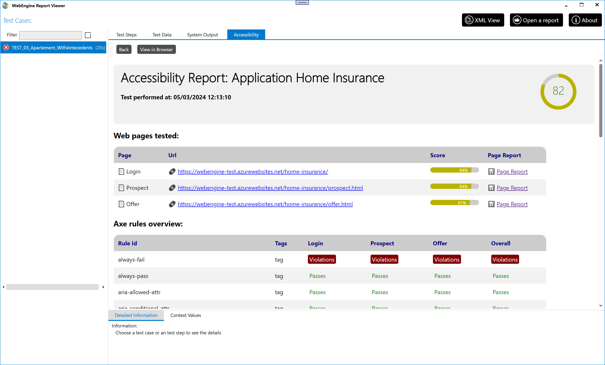

# Accessibility testing with WebEngine (or not)
From the version 1.2 of WebEngine Framework, we have integrated accessibility testing features to help you ensure your applications are accessible to all users. The Framework uses the Axe-core library to perform accessibility tests on your applications and provide you with an overall and detailed report of the issues found.

You can run accessibility tests on two distinct levels:
- **Single Page Level**: This level will run the accessibility tests on the current page.
- **User Journey**: This level will run the accessibility test on the entire user journey and shows you an overall test report.

## Features
Compared to other accessibility testing tools based on axe-core, we provide you with the following features:
- **Adaptability**: With just a single line of code. You can run accessibility tests on your existing selenium project. 
- **Extensibility**: You can test your application agasint additional rules you've customized.
- **RGAA**: We have made the work to tag axe html rules with RGAA regularation. So after the test, you have an idea of which RGAA rules are respected. *

> [!NOTE]
> \* The coverage of RGAA rule means that a rule is *covered* by test. It does not mean that the rule is *validated* by the test. To validate a rule, all test methodologies specified in the RGAA documentation must be checked and passed.

## Prerequisites
Working on Windows or MacOS, having the following SDK packages:
- **AxaFrance.AxeExtended.Selenium** : If you have an existing selenium based test solution without using WebEngine Framework. You can still run accessibility tests with this package.
- **AxaFrance.WebEngine.Web** : With V1.2+, the package has integrated accessibility testing and AxeExtended pacakge.

## Run accessibility tests on existing selenium project

Following are examples on how to run accessibility tests on a single page using `PageReportBuilder` or on multiple pages of a user journey by using `OverallReportBuilder`. It generates.
### Run accessibility test on a single page
To run accessibility tests on a single page, you can use the following code snippet:
```csharp
// Create a new instance of webdriver using Selenium
using var driver = BrowserFactory.GetDriver(AxaFrance.WebEngine.Platform.Windows, BrowserType.ChromiumEdge);

// Navigate to the page you want to test
driver.Navigate().GoToUrl("https://www.axa.fr");

// Do your orginal functional tests here
var filename = new PageReportBuilder()
    .WithSelenium(driver)
    .Build()
    .Export();

// filename will contain the path to the generated report
```
In resume, what you need to do create a new instance of `PageReportBuilder`, pass the Selenium driver to it, and call the Build method to generate the report.

### Scan options
If you want to customize the scan options, you can use the following code snippet:
```csharp
var filename = new PageReportBuilder()
    .WithOptions(new PageReportOptions()
    {
        HighlightColor = Color.Green,
        HighlightThickness = 5,
        ScoringMode = ScoringMode.Weighted,
        Tags = PageReportOptions.WcagAATags,
        ScreenshotIncomplete = true,
        UseAdvancedScreenshot = true,
    })
    .WithSelenium(driver).Build().Export();
```
The above code snippet will run the accessibility tests with the following options:
- **HighlightColor**: When using advanced screenshot, the identified element will be highlighred with Green color.
- **HighlightThickness**: The thickness of the highlight, 5 pixels.
- **ScoringMode**: Weighted or NonWeighted.
- **UseAdvancedScreenshot**: When active, the screenshot will be full screen with identified elements highlighted. Otherwise, the screenshot will be taken only on the element itself. it is easier to locate elements with Advanced screenshot, but it will be slower and uses more disk space.
- **Tags**: the tags identify the rules to use. In above example, we are scanning agating WCAG AA rules only.

To know more about the options, please refer to <xref:AxaFrance.AxeExtended.HtmlReport.PageReportOptions>.

### Run accessibility test on a user journey
To run accessibility tests on a user journey, you will need to use `OverallReportBuilder` instead of `PageReportBuilder`.
Here is an example:
```csharp
using var driver = BrowserFactory.GetDriver(AxaFrance.WebEngine.Platform.Windows, BrowserType.ChromiumEdge))
var defaultOptions = new PageReportOptions()
{
    Title = "AXA.FR",
    OutputFormat = OutputFormat.Zip
};
var builder = new OverallReportBuilder().WithDefaultOptions(defaultOptions);

//Analyze first page
driver.Navigate().GoToUrl("https://www.axa.fr/");
builder.WithSelenium(driver, "Main Page").Build();

//Analyze second page
driver.Navigate().GoToUrl("https://www.axa.fr/pro.html");
builder.WithSelenium(driver, "Pro").Build();

//Analyze third page
driver.Navigate().GoToUrl("https://www.axa.fr/pro/services-assistance.html");
builder.WithSelenium(driver, "Assistance").Build();

string report = builder.Build().Export();
```
Observing the above code snippet, you can see that we are using `OverallReportBuilder` to generate the report using a default option which will be applied to all pages. Then, we are navigating to different pages and calling the `WithSelenium` method to pass the driver, on each individual page.

Finally, we are calling the `Build` method to analyze and generate report and `Export` method to get the path to the generated report. As provided in the options, the report will be generated in zip format.

## Run accessibility tests on projects using WebEngine
### Keyword-Driven test case
When running accessibility test on an end-to-end test using keyword-driven method, there are two steps to follow.
#### Activate accessibility testing
Accessibility testing should be activated at Test Case level, so the scan engines are initialized and accessibility test result on each scan will be integrated in test report.
To activate accessibility testing on Test Case level, Set the property <xref:AxaFrance.WebEngine.Web.TestCaseWeb.IsAccessibilityTestEnabled> of test case to `true`. If you want to activate it dynamically via test data, you can provide a test case named `Accessibility` and set it to `True`
#### Scanning a page
In a shared action, at the convenient moment call the method <xref:AxaFrance.WebEngine.Web.SharedActionWeb.RunAccessibilityTest(System.String)>
This function runs an accessibility scan at current location, then integrates test result to test report. The scan can be performed multiple times on different location within a user journey. With this method, you don’t need to interact directly with classes such as `OverallReportBuilder` or `PageReportBuilder`
### Gherkin based test case
If you are using Gherkin based test case. You’ll need to follow the same steps:
•	Initilaize `OverallReportBuilder` before the execution of the scenario
•	Calls `builder.WithSelenium(driver, "Page Name").Build()` at the point you want to scan the page
•	Export the test result, or attach the test result to test report
Assuming `reportBuilder` is type of OverallReportBuilder and the export format is **ZIP**, use the following instructions to attach accessibility test result to your test report
```csharp
var a11yReport = reportBuilder.Build().Export();
testCaseReport.AttachFile(a11yReport, "AccessibilityReport");
```
The first statement exports test result to a zip file, then the second statement attachs it as `AccessibilityReport`.

### View accessibility test result
In Report Viewer, if a test case has attached Accessibility test result, `Accessibility` tab will be available. View overall test result, or click on a specific page to see detailed report.
It is also possible to view the report in a browser by clicking on the `View in Browser` button.



## Examples
In the data driven sample, you can find how accessibility tests are integrated in the test solution.
https://github.com/AxaFrance/webengine-dotnet/tree/main/src/Samples.DataDriven

- Test data: [Data-HomeInsurance.xlsx](../files/Data-HomeInsurance.xlsx) In the test data, we have added a row named `Accessibility` with value `True` to activate accessibility testing on the test case. Accessibility test is activated on the first test case.
- Scan, We have called `RunAccessibilityTest` to perform accessibility test on 3 pages: 
1. On Login action, perform test before submitting the form.
2. On Home details action, perform test before clicking on the next button.
3. On Choose offer and options page.

The above steps will generate accessibility test results for 3 pages in the test report, as showing in the screenshot above.

