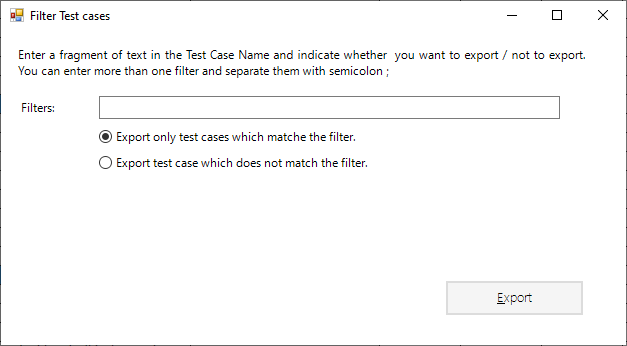

# Export Test data

WebEngine Add-in allows you to export test data and environment variables to XML format, then it can be consumed by test automation solution.

> ![IMPORTANT]
> Test automation solutions build with WebEngine Framework does not handle excel file directly.
> The test data must be exported as XML format.
> When a test is launched via Excel, the Add-in exports the test data into a temporary directory in XML and consumes it during test execution.

In the group of "Export" buttons, you can:
* **Export Selected**: Export selected tests to an XML formatted TestSuite Data file.
* **Export All (current tab)**: This buttons exports all test cases of current data sheet. By default, the xml file has the same name as the current sheet.
* **Export All (all tabs)**: This button export all test cases of every data sheet.
* **Export with filter**: This function export test cases with a simple filter.
For example, you want to execute tests where name contains "E2E", you can use E2E as filter 
 
* **Export environment variables**: This function exports environment variables (test data related to test environment) from sheet named "ENV". and generates ENV.xml.

