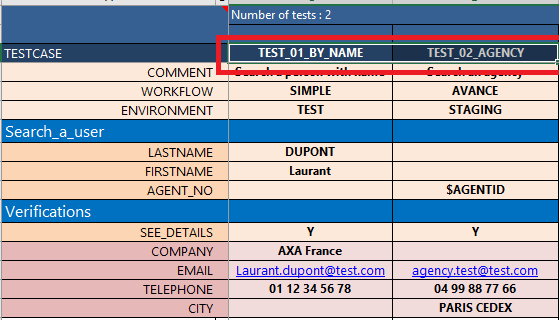
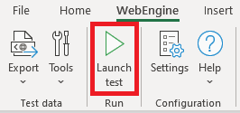
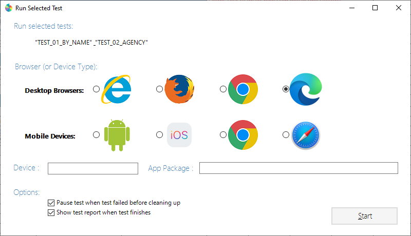

# Launch test execution
You can launch a test directly with-in excel, once the [Settings](excel-addin-settings.md) is done. To launch a test, follow below instructions:

## 1. Select tests to be executed
Select one or more tests to be executed.
You can select any row but please AVOID selecting whole columns,
because Add-in will calculate selected cells and determine test data to be exported.
Select whole columns will lead to analyze all possible lines (that is 1 million rows)

## 2. Click "Launch Test"
Then click on the button `Launch Test` available from the WebEngine add-in tab:

## 3. Choose the browser and enjoy
On the `Run selected test` dialog, you can see a list of selected test cases to be run.
According to your requirement choose a desktop browser or a mobile platform

### Desktop Browsers
WebEngine Framework supports these 4 desktop browsers:
* Internet Explorer `deprecated`
* Mozilla Firefox
* Google Chrome
* Microsoft Edge (Chromium based)

### Mobile Devices
You can also launch the test of Web or Native Mobile apps directly.
* Android Device (for Android application, provided in APK package)
* iOS Device (for iOS application, provided in IPA package)
* Google Chrome Mobile (To test Web Applications in Android Device)
* Safari (to test Web Application in iOS Device)

To launch tests on mobile devices, you'll need to specify following parameters:
* `Device`, used for both Mobile Web or Mobile App testing, in order to select a device from a Selenium Grid compatible device cloud, or Local Appium Server according to settings.
* `App Package`, used only for Mobile App testing, indicates the path of APK or IPA package to be uploaded and installed on test device.
