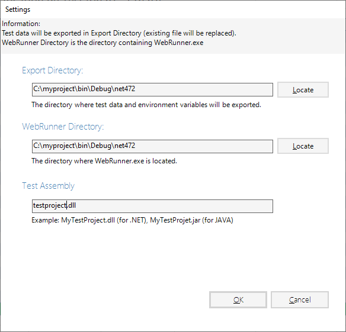

# Settings

## Settings dialog
Before tests can be launched directly from Excel via WebEngine Add-in for Excel, 
you'll need to configurate it to connect the add-in and your test automation solution.

## Parameters
The settings, as shown as above, has 3 parameters:

* `Export Directory`: This parameter indicates the path export Test Data and Environment Variables.
* `WebRunner Directory`: This parameter indicates the path of your test automation solution, where locates your solution and WebRunner.
* `Test Assembly`: The file name of your compiled test automation solution. Usually it's a DLL file (for .NET) and JAR file (for JAVA).

> [!NOTE]
> WebEngine Add-in for Excel automatically detects the version of the Framework used.
> For TAS (Test Automation Solution) built with .NET, it will launch `WebRunner.exe`. For
> TAS built with Java, it will launch `WebRunner.jar`.

The settings will be saved for next use.
If you are working with another TAS, you'll need to change these settings.
