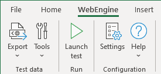

# Working with WebEngine Add-in for Excel

In many enterprises, Excel is used a lot to do data related works. Many test teams use it to manage Test Data for manual or Automated Tests.
Web Engine Excel Add-in is built to easily manage test data and execute tests on local computer.

The add-in can be used by all team members:
* Testers and Product Owners can define and maintain test data, launch automated tests and observe the execution.
* Test Automation Engineers and Developers can develop and debug the test solution.

## Overview

The Excel add-in enables you to:

* Export test data from Excel to xml files.
* Launch test executions.
* Define generation and execution options.
* Generate some piece of code to ease maintenance.

> [!IMPORTANT]
> Test automation solution does NOT consume EXCEL format as test data.
> Instead, Test Data and Environment Variables are always provided in XML format, exported via the Add-in.

## Install WebEngine Excel Add-in
Latest version of Excel add-in can be found on our repository: (https://www.github.com/replace_this_url_once_available)

## Example Test Data File
You can download a copy of example test data file here: [WebEngine-TestData.xlsx](../files/WebEngine-TestData.xlsx), and follow articles listed in this chapter to understand the structure of the test data file.

In this chapter, you can also find details about:
* [Export Test Data](excel-addin-export.md)
* [Settings](excel-addin-settings.md)
* [Launch Test from Excel](excel-addin-settings.md)
* [Integrated Tools](excel-addin-settings.md)

