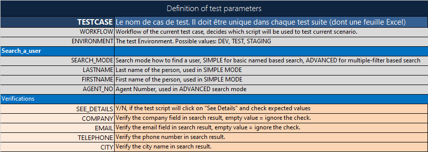
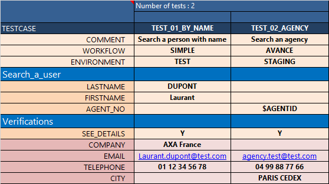

# Excel file structure
This article explains the structure of the Excel spreadsheet which WebEngine Add-in can work.

## File Structure
A test data spreadsheet contains at least 3 sheets as follows.
You can download the example Excel file and start yours from it.

### PARAM
Referenced all test parameters which can be used in the automation solution.
The comments on the parameter can be used in code generation, so automation engineers can understand each parameter when used in the script.

The Excel sheet must be named `PARAM`, Parameter names **cannot** contains space.

For example: these are the parameters of a system to search people in a corporation.

### ENV
Used to store technical parameters related to test environment, such as URL of the application, password or environment related test data.

The Excel sheet must be named `ENV`

Above example demonstrates the usage of some environment dependent test data such as `URL` and `AGENTID`, which can be picked up according to the test environment provided in test data.

### Test Data
You can have one or more test data sheet within the file. In general, every sheet represents a test suite or tests with similar objective.

