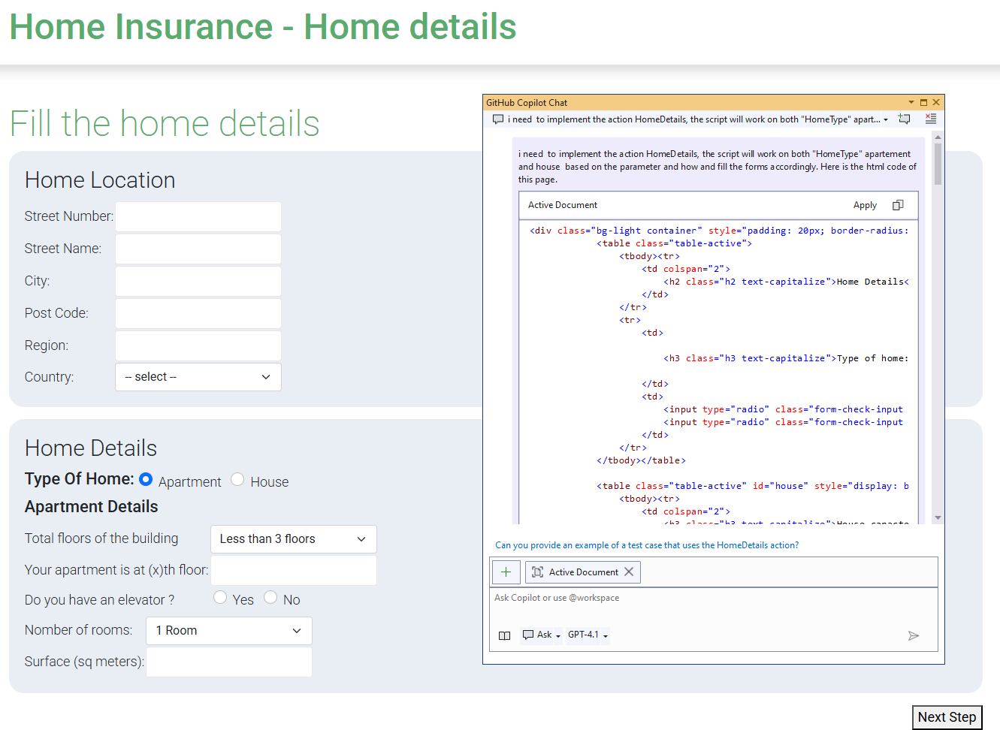
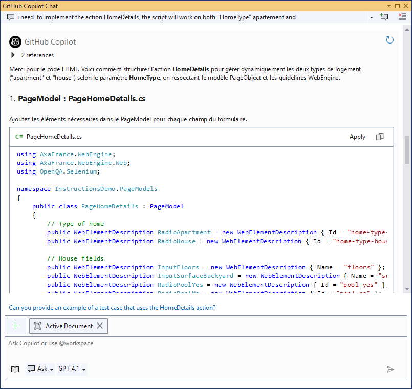

# Using GitHub Copilot with WebEngine Framework

This documentation provides a guide on how to leverage GitHub Copilot for code completion and assistance in writing test automation scripts using the WebEngine framework. It also ensures that all generated scripts align with test automation best practices. Below, we detail the setup, structure, and guidelines to maximize Copilot's contextual understanding for test automation.

## Add github instructions to your repository
In your test automation project, create a new folder named `.github` in the root directory of your repository.
Inside this folder, copy `copilot-instructions.md` from WebEngine repository to your project.
Once you have restarted Visual Studio or Visual Studio Code, Copilot will use the instructions from this file to assist you in writing test automation scripts.

## What are the changes by using this instructions file?
The instructions.md file has been added to the project to provide Copilot with detailed context about WebEngine. This ensures that code suggestions are tailored to the framework and follow best practices.

### Key Highlights of the instructions.md File
- Context: Describes the use of WebEngine with Selenium WebDriver for test automation.
- Test Approaches: Emphasizes Keyword-Driven Testing and BDD, with a preference for the former.
- Best Practices:
	- Use the Page Object Model (POM) design pattern.
	- Avoid hardcoded locators; use ElementDescription or AppElementDescription.
	- Externalize test data and access it via parameterization.
	- Leverage native functions of WebEngine wherever possible.
	- Organize project files into predefined folders for better maintainability.

### Example of Prompting
You can ask Copilot to generate test automation scripts by providing a brief description of the actions, you can even copy and paste the html codes in the conversation window.
Copilot will follow the guidelines specified in the instructions file to generate code that adheres to best practices:
- Generate Page Object Models for web pages and defin elements using ElementDescription.
- Generate SharedActions for reusable actions across test cases.
- etc.
All generated code will be placed in the appropriate folders as per the project structure defined in the instructions.

```text
<ProjectFolder>
│
├── PageModels      # Stores all Page Object Model classes
├── Actions         # Contains reusable SharedAction classes
├── TestCases       # Stores all test scenario classes
├── TestData        # Contains test data files (e.g., XML, Excel)
│
└── <OtherFiles>
```

Here is an example of prompt that we ask copilot to generate test scriptm, and pasted the html fragment of the container:



We can see that Github Copilot generates the code step by step:
1. It first generates the Page Object Model for the container.
2. Then it generates the SharedAction to click on the container.
3. It generates the test parameters used in SharedAction.




## Conclusion
As we can see, using GitHub Copilot with the provided instructions file significantly enhances the development experience for test automation scripts in WebEngine. It ensures that the generated code is consistent, maintainable, and adheres to best practices, allowing developers to focus on writing effective tests rather than boilerplate code.
