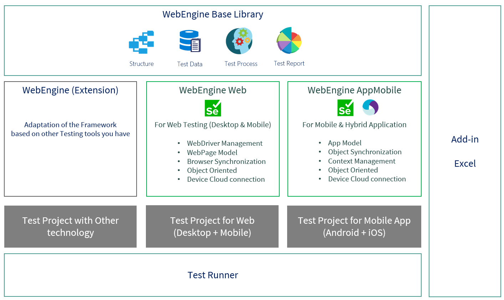

# Introduction to WebEngine Framework

WebEngine is a Test Automation Framework (TAF) that makes it easy to build reliable, maintainable test automation solutions for **Web**, **Mobile Web** and **Mobile App** testing.
The framework is built on top of Selenium and Appium, and extends them with standardized approaches, built-in best practices and ready-to-use tooling so your team can focus on test logic rather than framework plumbing.

Tests built with WebEngine can run locally, on a remote Selenium Grid, or be integrated into any Continuous Integration / Continuous Delivery pipeline.

## Why WebEngine instead of plain Selenium?

Selenium and Appium are excellent low-level libraries, but using them alone means every team must solve the same infrastructure problems from scratch.
WebEngine solves these problems once, for everyone:

| Problem with plain Selenium / Appium | WebEngine solution |
|---|---|
| Manual WebDriver download and version alignment | `BrowserFactory` detects browser version and fetches the right driver automatically |
| `StaleElementReferenceException` / timing issues | Every element action has a built-in **synchronized retry loop** |
| Fragile single-locator element identification | `WebElementDescription` supports **multiple combined locators** |
| Passwords in plain text in scripts or data files | `SetSecure` + `Encrypter` — cipher text stored, decrypted on the fly |
| Test data duplicated inside test scripts | Excel-based externalization, environment switching without code changes |
| No structure conventions — hard to onboard | Recommended project layout enforced by Copilot instructions |
| Selenium / Appium not accessible to AI tools | **MCP server** exposes live browser control to GitHub Copilot and other AI assistants |

For the full explanation of each practice, see [Best Practices in WebEngine Framework](best-practices.md).

## Framework Components

WebEngine is composed of **7 components**. Install only what you need.

* `WebEngine Base Library` (`AxaFrance.WebEngine`): Core data structures — Test Suites, Test Cases, Test Steps, Test Data, Environment Variables and Test Reports. Required by all other components.
* `WebEngine Web` (`AxaFrance.WebEngine.Web`): Selenium WebDriver management, Web Element identification, Page Models and browser utilities for desktop and mobile browsers.
* `WebEngine MobileApp` (`AxaFrance.WebEngine.MobileApp`): Appium WebDriver management, App Element identification and device connection for native Android and iOS applications.
* `WebEngine MCP` (`AxaFrance.WebEngine.Mcp`): An MCP (Model Context Protocol) server that exposes live Selenium and Appium capabilities to AI assistants such as GitHub Copilot, enabling AI-driven browser and mobile automation.
* `Excel Add-in`: Manage, export and launch test execution directly from Excel spreadsheets when using the Data-Driven approach.
* `Test Runner` (`WebRunner`): The command-line executable to run automated tests with a given configuration. Produces a structured XML report consumable by Report Viewer.
* `Report Viewer`: A graphical viewer for test reports — synthetic overview and detailed step-level trace in one tool.



> [!NOTE]
> Current development status and supported actions per component are listed in [Development Status](dev-status.md).

## Installation

Choose the packages matching your scenario. All packages are available on NuGet (.NET) and Maven (Java).

| Scenario | Required packages |
|---|---|
| Web testing — any approach | `AxaFrance.WebEngine` + `AxaFrance.WebEngine.Web` |
| Mobile browser testing | above + Appium server or Selenium Grid |
| Native Android / iOS app testing | `AxaFrance.WebEngine` + `AxaFrance.WebEngine.MobileApp` |
| Keyword-Driven or Data-Driven execution | above + `AxaFrance.WebEngine.Runner` (WebRunner) |
| Local report viewing | + `AxaFrance.WebEngine.ReportViewer` |
| AI-assisted automation via MCP | + `AxaFrance.WebEngine.Mcp` |

### Example: Keyword-Driven approach for a Web Application
```
AxaFrance.WebEngine
AxaFrance.WebEngine.Web
AxaFrance.WebEngine.Runner   ← for test execution via WebRunner
```

### Example: Unit Tests for an iOS Native App
```
AxaFrance.WebEngine
AxaFrance.WebEngine.MobileApp
```
The test runner is provided by the unit test framework you choose (NUnit, MSTest, XUnit, JUnit).

### Example: Gherkin / BDD for a Web Application
```
AxaFrance.WebEngine
AxaFrance.WebEngine.Web
```
The runner is provided by your Gherkin framework (SpecFlow, Cucumber).

## Extension

If you need to automate an application that Selenium cannot reach, you can build an extension on top of `WebEngine Base Library`.
Your extension inherits the same test structure, data management and reporting while using a different underlying driver.

For example, some teams at AXA use *MicroFocus UFT Developer* alongside WebEngine.

## Going Further

| Topic | Where |
|---|---|
| Built-in best practices explained | [Best Practices](best-practices.md) |
| Supported browsers, platforms and actions | [Development Status](dev-status.md) |
| Configuration file reference | [Test Configuration (appsettings.json)](appsettings.md) |
| GitHub Copilot integration | [Using GitHub Copilot with WebEngine](github-copilot.md) |
| CI/CD integration | [Tutorials → CI/CD](../tutorials/ci-cd.md) |

