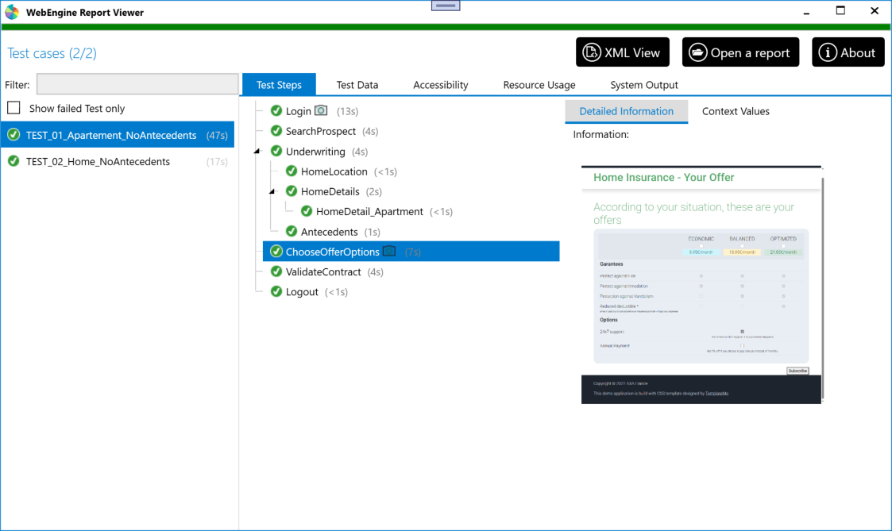

# View Report with ReportViewer
ReportViewer is an application to view test results in a graphical way.

As shown as follow, Test cases executed have been listed on the left side.
Once a test case is selected, detailed test steps, test data, screenshot and other necessary information will be shown on the right side.

## When report is generated?
Each test execution via `WebRunner.exe` or `webrunner.jar` generates a test report in the given directory provided by `-outputDir` parameter.
When tests are launched with option `-showReport`, the report viewer will be launched automatically after test execution.

> [!IMPORTANT]
> DO NOT use option `-showReport` when the test is launched on a DevOps platform.
> It will show an UI based application on remote server which may cause problems.

## View an existing Report
The report generated by the WebEngine Framework is XML. To open an existing Report, click on the button `Open a report`

# HTML Report
If you don't want to use the report viewer, it is also possible to generate an HTML report.
HTML report contains information about test structure and test data.
But in terme of the complexity, it is not possible to view Accessibility result and Resource Usage result in HTML report.

