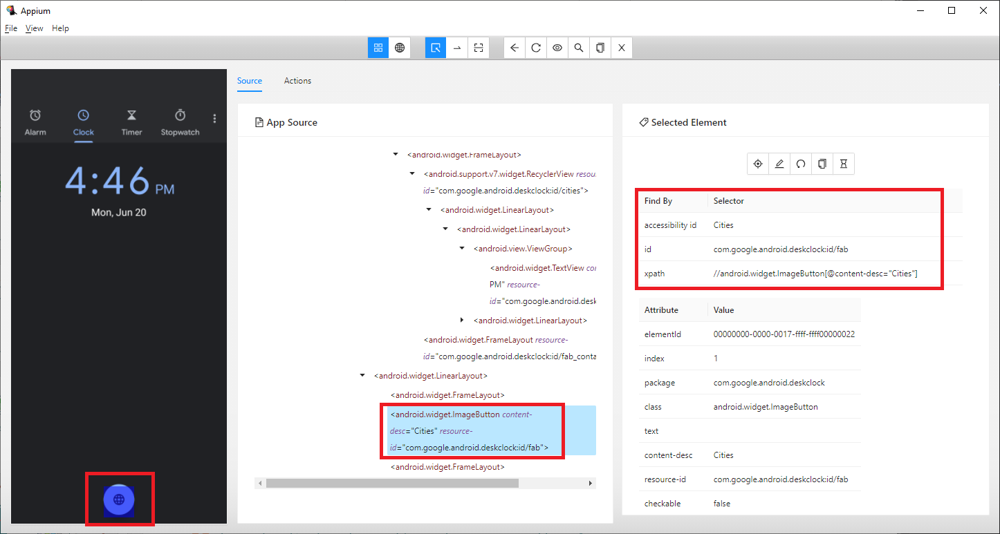

# Test Mobile Applications
If you are already familiar with web application automation,
it's not hard to build test automation solutions for native or hybrid applications.
Similar to functionalities provided in <xref:AxaFrance.WebEngine.Web>,
WebEngine framework exposes similar API in the namespace <xref:AxaFrance.WebEngine.MobileApp>.

API provided in MobileApp namespace is based on Appium 5.0.

> [!NOTE]
> The library MobileApp is used to test native mobile applications. And the applications is provided as APK or IPA package.
> To test Web applications on a Web Browser, please use <xref:AxaFrance.WebEngine.Web> library.

To test mobile applications with WebEngine Framework, you'll need to have follow knowledges as pre-requisites:
* Basic knowledges on Android and iOS devices.
* Able to use [Appium Inspector](https://github.com/appium/appium-inspector) to identify UI elements.
* Have basic knowledge on Selenium WebDriver, in C# or Java.

## Use AppFactory to manage AppPackage and Device connection
<xref:AxaFrance.WebEngine.MobileApp.AppFactory> is used to initialize Device cloud connection and app package uploading.

Before launching the automated tests on Mobile devices, you'll need to tell Appium Server to start the application under test.
Or if the application is not yet installed, to install it.
WebEngine Framework can upload the app package to compatible platforms, by calling the method <xref:AxaFrance.WebEngine.MobileApp.AppFactory.UploadAppPackage(System.String,System.String,System.String,System.String)>, it returns the real `AppId` to be used to connect to remote devices.

Then you can use <xref:AxaFrance.WebEngine.MobileApp.AppFactory.GetDriver(AxaFrance.WebEngine.Platform)> to get AppiumDriver in order to interact with test scripts.
According to your test settings, AppiumDriver can be either:
* <xref:OpenQA.Selenium.Appium.iOS.IOSDriver> if you are testing on iOS devices. In this case, WebEngine uses XCUITest as native automation engine.
* <xref:OpenQA.Selenium.Appium.Android.AndroidDriver> if you are testing on Android devices. In this case, WebEngine uses UIAutomator2 as native automation engine.

## Use ElementDescription to manage Application Object Identification
<xref:AxaFrance.WebEngine.MobileApp.AppElementDescription> inherited from <xref:AxaFrance.WebEngine.Web.ElementDescription> is used to identify test objects (Button, Text Box, Label, or other Elements) of an app easily and efficiently.

Take an example of the following example, we want to identify the button on the bottom of the screen, as what we got from Appium Inspector


This element can be identified with as follows:
# [.NET](#tab/ednet)
```csharp
//In C#, you can declare the app element with any combination of properties
var btnCity = new AppElementDescription(driver)
{
    Id = "com.google.Android.deskclock:id/fab"
};

//then perform any actions on this object.
btnCity.Click();
```
# [JAVA](#tab/edjava)
```java
/* In Java you can declare the Web Element by using a builder. */
AppElementDescription btnCity = new AppElementDescription.builder()
    .useDriver(driver)
    .id("com.google.Android.deskclock:id/fab")
    .build();

/* then perform any actions on this object. */
btnCity.click();
```
***

## Use PageModel to store test objects
The same as Web Application Testing, you can store all <xref:AxaFrance.WebEngine.MobileApp.AppElementDescription> used in a script into <xref:AxaFrance.WebEngine.Web.PageModel>s.

If you are working on hybrid applications, you can even mix <xref:AxaFrance.WebEngine.Web.WebElementDescription> and <xref:AxaFrance.WebEngine.MobileApp.AppElementDescription> into the same PageModel.

## Hybrid applications
Hybrid application is an application that contains WebViews. During the test, you may need to switch to web views, do something then switch back.
To switch context, Use <xref:AxaFrance.WebEngine.MobileApp.AppFactory.SwitchContext(OpenQA.Selenium.Appium.AppiumDriver,System.String)>.

## Example Project
Sample projects are available using different language and test approaches, please follow this link:
[Sample Projects](../tutorials/toc-sample.md)
