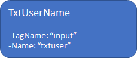
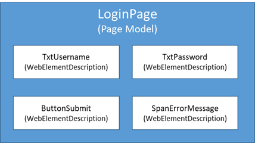

# Test Web Applications
With functionalities provided by <xref:AxaFrance.WebEngine.Web>, it is easy to build tests using Selenium WebDriver running on Desktop and Mobile browsers.
To test web application, we usually need to open the web browser and perform three kinds of actions on system under test:

* Localizes Web Elements: The button we want to click, the textbox we want to fill, etc.
* Performs actions on Web Elements: The button we want to click, the textbox we want to fill, etc.
* Compares the information retrieved from some Web Element with expected value.

In WebEngine Framework, we have provided  : 
* <xref:AXA.WebEngine.Web.BrowserFactory> to easily manage web browsers and selenium webdrivers 
* <xref:AXA.WebEngine.Web.PageModel> and <xref:AXA.WebEngine.Web.WebElementDescription> to manage Web Elements.

## Prerequisites
To test web applications with WebEngine Framework, you'll need to have follow knowledges as pre-requisites:
* Basic knowledge on Web and HTML Document
* Able to use Development Tools provided by Web Browser to inspect Web Elements
* Have basic knowledge on Selenium WebDriver, either in C# or Java


## Use BrowserFactory to manage Selenium WebDriver
<xref:AxaFrance.WebEngine.Web.BrowserFactory> is used to open selected browser of which the test suite will execute on. For example, a single line of code:

```cs
var driver = BrowserFactory.GetDriver(AxaFrance.WebEngine.Platform.Windows, AxaFrance.WebEngine.BrowserType.ChromiumEdge);
```

# [.NET](#tab/browserfactory)
```csharp
var driver = BrowserFactory.GetDriver(AXA.WebEngine.Platform.Windows, AXA.WebEngine.BrowserType.ChromiumEdge);
```

# [JAVA](#tab/browserfactory)
```java
Optional<WebDriver> webDriver = BrowserFactory.getDriver(Platform.WINDOWS,Browser.CHROMIUM_EDGE); 
```
***


Will perform following actions:
-	Determines the Edge browser installed on your computer
-	Downloads the Edge WebDriver from official repository according to its version
-	Initializes the Selenium WebDriver

For mobile testing, the following line of code:
```cs
var driver = BrowserFactory.GetDriver(AxaFrance.WebEngine.Platform.Android, AxaFrance.WebEngine.BrowserType.Chrome);
```
Will perform following actions
-	Connects to Selenium Grid or Appium Server
-	Initializes Selenium WebDriver and open Chrome on selected device
-	Returns an AppiumDriver to end user.

## Use ElementDescription to identify Web Elements
<xref:AxaFrance.WebEngine.Web.WebElementDescription> is used to identify a test object (Button, Text Box, Label, or other WebElements) on the web page.
A Web Element can be identified by one or more properties, for example, its Tag Name, Id, Name, CssClass, XPath or other HTML Attributes.

WebEngine Framework will use the provided properties to filter and select element from the current web page.
For example, to identify the `<input>` tag we may use these two attributes:



# [.NET](#tab/ednet)
```csharp
//In C#, you can declare the Web Element with any combination of properties
var TxtUserName = new WebElementDescription(driver)
{
    TagName = "input",
    Name = "txtUser"
};

//then perform any actions on this object.
TxtUserName.SetValue("admin@test.com");
```
# [JAVA](#tab/edjava)
```java
/* In Java you can declare the Web Element by using a builder. */
WebElementDescription txtUserName = new WebElementDescription.builder()
    .useDriver(driver)
    .tagName("input")
    .name("txtUser")
    .build();

/* then perform any actions on this object. */
txtUserName.setValue("admin@test.com");
```
***

In WebEngine Framework, object identification is secured against web page synchronization and refresh.
That means there is no need to add time wait everywhere in the code as many do,
The framework will handle synchronized page loading, or asynchronized page update transparently.


> [!NOTE]
> The object WebElementDescription is not the IWebElement itself used by Selenium,
> but a descriptor indicating how to identify the element.


## Use PageModel to store test objects
One of the best practices of test automation is to separate :
-	the object identification 
-	the logic of the test script.

In WebEngine Framework, you can store one or more test objects into a <xref:AxaFrance.WebEngine.Web.PageModel>.

In practice, imagine a login page containing username and password, the submit button and a span containing error messages.
You can create a PageModel named LoginPage, containing the above 4 test objects which will be used in the script.



As a result, you can declare the page model as following:

# [.NET](#tab/pmnet)
```csharp
public class LoginPage : PageModel
{
    public WebElementDescription TxtUsername = new WebElementDescription
    {
        TagName = "input",
        Name = "username",
    };

    public WebElementDescription TxtPassword = new WebElementDescription
    {
        TagName = "input",
        Name = "password",
    };

    public WebElementDescription ButtonSubmit = new WebElementDescription
    {
        Id = "submit"
    };

    public WebElementDescription SpanErrorMessage = new WebElementDescription
    {
        TagName = "span",
        ClassName = "alert errormessage"
    };

    public LoginPage(WebDriver driver) : base(driver)
    {
    }
}
```
# [JAVA](#tab/pmjava)
```java
public class LoginPage extends AbstractPageModel{
    @Getter
    WebElementDescription txtUsername = WebElementDescription.builder().tagName("input").name("username").build();
        
    @Getter
    WebElementDescription txtPassword = WebElementDescription.builder().tagName("input").name("password").build();  
    
    @Getter
    WebElementDescription buttonSubmit = WebElementDescription.builder().id("submit").build();
    
    @Getter
    WebElementDescription spanErrorMessage = WebElementDescription.builder().id("span").className("alert errormessage").build();
    
    public LoginPage(WebDriver webDriver) throws Exception {
        populateDriver(webDriver);
    }

}
```
***

In the test script, when you need to perform actions on this login page, just initialize the page model and use it.
The test script is object-oriented, clear to read and easy to maintain.
# [.NET](#tab/usepmnet)
```csharp
LoginPage page = new LoginPage(driver);
page.TxtUsername.SetValue("admin@test.com");    //fill username
page.TxtPassword.SendKeys("password");          //fill password
page.ButtonSubmit.Click();                      

if (page.SpanErrorMessage.IsDisplayed)          //check if error message shows
{
    //error message displayed, test failed.
    return false;
}
else
{
    //error message not displayed, test success.
    return true;
}
```
# [JAVA](#tab/usepmjava)
```java
LoginPage page = new LoginPage(driver);
page.getTxtUsername().setValue("admin@test.com");    //fill username
page.getTxtPassword().sendKeys("password");          //fill password
page.getButtonSubmit().click();                      

if (page.getSpanErrorMessage().isDisplayed()){        //check if error message shows
    //error message displayed, test failed.
    return false;
}else{
    //error message not displayed, test success.
    return true;
}
```
***

## Example Projects
Sample projects are available using different language and test approaches, please follow this link:
[Sample Projects](../tutorials/toc-sample.md)
