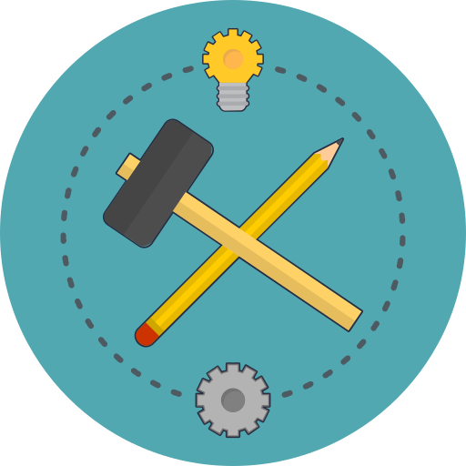

# AxaFrance WebEngine Framework

A Test Automation Framework (TAF) is a set of guidelines and libraries for creating and designing test cases.
It is a conceptual part of automated testing that provides common functionalities and best practices, helping Test Automation Engineers to build reliable, maintainable and well-structured Test Automation Solutions (TAS).

AxaFrance WebEngine Framework makes it easy to build highly effective test automation solutions for **Web**, **Mobile Web** and **Mobile App** testing.

Built by the Test Guild of AXA France, available in **.NET** and **Java**, and used across a dozen test automation projects within AXA France. We decided to open-source this framework to share our knowledge on Test Automation with the community and improve software quality together 😉.

## Why WebEngine Framework?

WebEngine resolves common problems that arise in test automation projects, embedding best practices directly into the framework so every team benefits automatically.

* **No more driver management headaches** - BrowserFactory detects your installed browser version and downloads the correct WebDriver automatically.
* **Resilient element identification** - WebElementDescription lets you combine multiple locators (Id, Name, CSS, XPath, custom HTML attributes).
* **Built-in synchronization** - Every element action has an automatic retry loop. StaleElementReferenceException and timing issues are handled by the framework, not by Thread.Sleep() in your code.
* **Page Object Model by design** - PageModel cleanly separates element descriptions from test logic.
* **Secure credential handling** - SetSecure decrypts and types passwords on the fly.
* **Test data externalization** - Add new test cases and switch environments without changing code.
* **AI-powered test authoring** - The built-in MCP server exposes live browser control to GitHub Copilot and other AI assistants.
* **Cross-platform from one API** - The same BrowserFactory works for Windows, macOS, Android and iOS.
* **Graphical test reports** - Report Viewer provides synthetic overview and step-level detail.
* **Open Source** - Free to use. Contributions welcome!

For a detailed explanation of every built-in practice, see [Best Practices in WebEngine Framework](articles/best-practices.md).

## Getting started.
* Introduction: Explains common concepts of the framework.
* API Reference: Explains every class, method and property.
* Tutorials: Follow some step by step tutorial to build first test automation solution using by differents approaches.

| || ||
|--------------|--------------|--------------|--------------|
| [Introduction](articles/intro.md) | [.NET API Reference](<xref:AxaFrance.WebEngine>) | <a href="api_java/">JAVA API Reference</a> | [Tutorials & Examples](tutorials/intro.md) |

## Show case
<iframe frameborder="0"  src="https://www.dailymotion.com/embed/video/k7kedqwLLueznayqBmd" allowfullscreen allow="autoplay"/>

## Use the latest version
The Framework is distributed via Package Management: NuGet for .NET version and Maven for JAVA Version.

## Contact us
Feel free to reach us if you want to adopt the Framework, report Bugs or have good ideas to contribute on it.

### Repository of .NET Project and shared components:
+ https://github.com/AxaFrance/webengine-dotnet
+ Main contributor: Huaxing YUAN   

### Repository Java Project:
+ https://github.com/AxaFrance/webengine-java
    + Main contributor: Joseph ARUL ,
    Jean-Prince DOTOU-SEGLA ,

