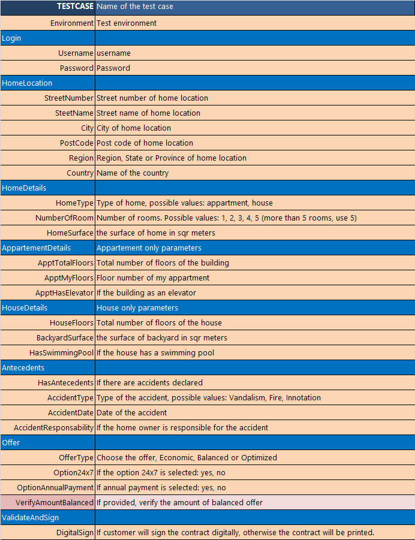
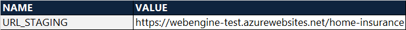
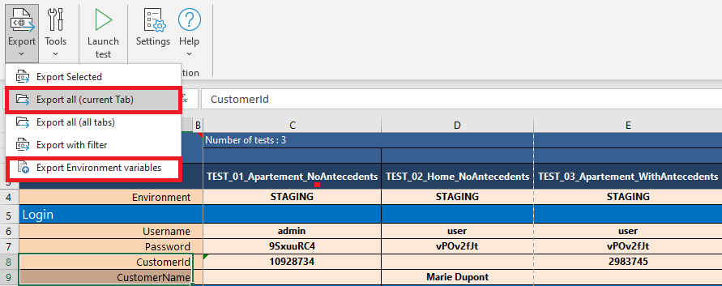
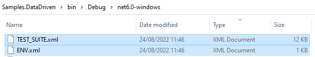
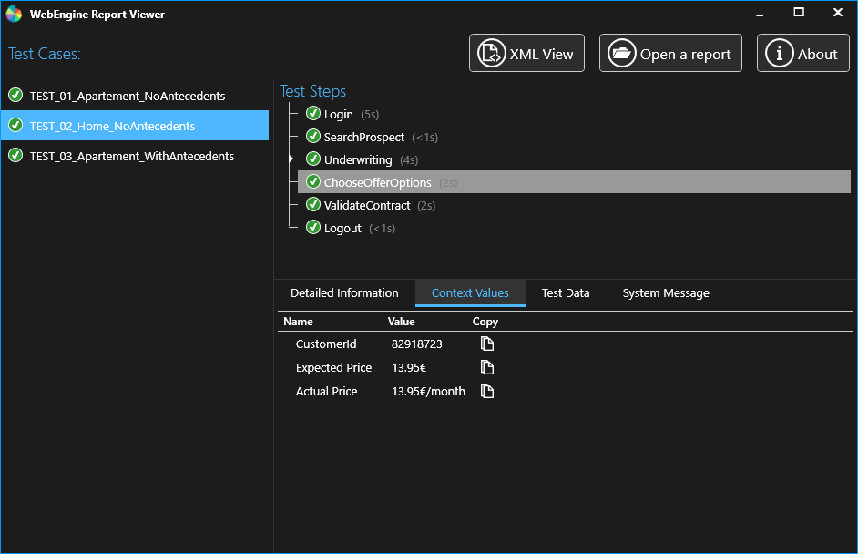
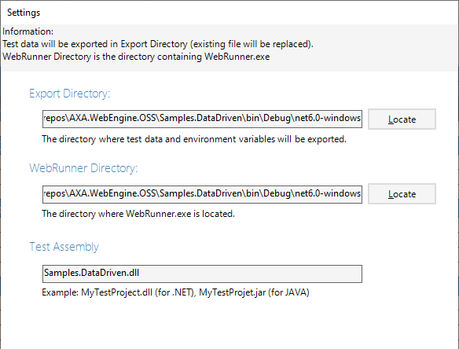

# Data-Driven testing Approach (C#/.NET)

This article will show steps to build an Automation solution based on Keyword-Driven testing approach with `Externalized test data` and `Dynamic execution based on test data`.
We will continue from the previous test project for application http://webengine-test.azurewebsites.net/home-insurance.

# Prerequisite:
* Familiar with [Keyword-Driven testing approach](keyworddriven.md)
* Have already followed the tutorial [Keyword-Driven testing Approach (C#/.NET)](keyword-driven-cs.md) and have a working project.

# Step 1: Review modulization, project structure and keywords
The modelling of Home Insurance Underwriting application may look like following diagram:

> [!NOTE]
> This tutorial is based on the outcome of [Keyword-Driven testing Approach (C#/.NET)](keyword-driven-cs.md). If you don't have a working keyword-driven test project yet, please follow that article first.

# Step 2: Identify variables
In this step, we'll need to identify variables used in the test automation solution.
To record and manage test data the most convenient way is to use an Excel spreadsheet under WebEngine format.
So you can benefit from the functionalities implemented in WebEngine Excel Add-in and launch data-driven test cases directly from Excel.

For more information about Excel test data
* [Excel Add-in](../articles/excel-addin.md)
* [Download Excel test data for this tutorial](../files/Data-HomeInsurance.xlsx)

Test data will have 3 sheets:
`PARAMS`: All the possible parameters of test case and it's description.
`ENV`: Test environment dependent variables such as URL or the site or the name of the server.
`TEST_SUITE`: represents the test suite (including a list of test cases)

For this test, we developed following test data
# [PARAMS](#tab/param)
Describes all the test parameters

# [ENV](#tab/env)
Here we lists all test environment dependent variables such as URLs.

If you have more than one test environment, you can list all data with prefix or postfix

# [TEST_SUITE](#tab/testsuite)
In test data we will specify the test cases and test data used for each test case.

For example: our test suite will have 3 test cases, covers Apartment, House and Apartment with previous accident.
From spreadsheet we can clearly see how parameters are used and have an idea about the test coverage of each parameter.
To increase test coverage, we can simply create new columns without the need to modify the test script.

***

> [!NOTE]
> There is no need to develop every parameter and the variable for every test case.
> The solution can be improved with the time by increasing test coverage in width (by increasing test cases) and in depth (by increasing test parameters)

# Step 3: Using test parameters in the script.
## 3.1: Import test parameters from EXCEL
The function of WebEngine Addin -> Tools -> Code Generation can generate a C# class `ParameterList` for you, including all test parameters with their descriptions as comment

# [Why use ParameterList](#tab/why-parameter-list)
Using parameter list are following advantage:
* Benefit from code auto-completion from development tools.
* Understands the meaning of the parameter thanks to the comments.
* Avoid type error in the test script.

# [Content of ParameterList](#tab/content-parameter-list)
[!code-csharp[Main](../../Samples.DataDriven/Parameterlist.cs "ParameterList")]
***

## 3.2: Use variables in the script
In actions, you can use `EnvironmentVariables.Current.GetValue("NAME")` to retrieve the value of an Environment Variable (listed in ENV spreadsheet). and use `GetParameter("NAME")` function to retrieve test data.

For Example, compared to the hard-coded login action, now the keyword action `Login` looks like following code snippet:

* We get the parameter `Environment` from test data
* Get `URL` from Environment Variables.
* Fill `username` and `password` with the value from parameter `Username` and `Password`
This action can do whatever needed according to the test data provided.

# [Login.cs (Hard Coded)](#tab/login-hc)
[!code-csharp[Main](../../Samples.KeywordDriven/Actions/Login.cs "Login")]
# [Login.cs (Data Driven)](#tab/login-dd)
[!code-csharp[Main](../../Samples.DataDriven/Actions/Login.cs "Login")]
***

# Step 4: Data-Driven test script

Repeat the step 3.2 on every keyword action, you can completely remove hard coded test data.
But sometimes it's not enough, because test procedure may change as test data changes.

## 4.1 Manages test process driven by data
In our application `home type` can be `apartment` or `house`, according to its value.
The forms will be different.

Our script must implement this logic driven by test data data: when the type is `apartment`, the script will fill form for apartments, otherwise the script will fill form for houses.

This logic is implemented in the keyword action `HomeDetails`, according to the value of home type, different sub-action will be executed.
[!code-csharp[Main](../../Samples.DataDriven/Actions/HomeDetails.cs "Home Details")]

## 4.2 Manages optional actions in the script
Sometimes a part of test script is optional based on test data.

Let's take the antecedent page for example: When the user checks `no`, there is nothing else to do. But when checks `yes`, user must fill the details. This logic can be coded under a `if` statement:

# [Antecedent Page](#tab/antecedent)

# [Keyword Antecedent.cs](#tab/antecedent-code)
[!code-csharp[Main](../../Samples.DataDriven/Actions/Antecedents.cs "Login")]
***

You can also control optional actions like verifications.

## 4.3 Resume
With above technics, you can control the test process or optional actions by external data.
That means if every keyword action is implemented like above examples,
you can run tests with any combination of data without the need to modify and update the code.

In general, simple controls can be implemented with `if` statement. but when the flow control becomes complex, it is recommended to separate these logics into sub-actions to keep an action at a reasonable complexity.

# Step 5: Dynamic test suite driven by data
We have improved every keyword action, and technically we can run test case with any combination of test data.
But we have on last problem: Test suite is still hard-coded.

There is only one test case in the Test Suite and we haven't linked the test case with test data:

Now we are going to fix it by modifying the function `getTestCases` so it can dynamically generate test cases by provided test data.

# [Test Suite (hard coded)](#tab/ts-hardcoded)

Previous example uses hard-coded test suite which test data is not used and the list of test case is fixed.

[!code-csharp[Main](../../Samples.KeywordDriven/TestSuite.cs "TestSuite")]
# [Test Suite (dynamic)](#tab/ts-dynamic)

In this example, we will initialize test cases with provided data.
As shown in the example test data file in Excel, the following code should generate 3 case cases during execution.

[!code-csharp[Main](../../Samples.DataDriven/TestSuite.cs "TestSuite")]
***

# Step 6: Export test data
Now go back to Excel test data and export Test Data and Environment Variables.
Save them to the same level of WebRunner.exe and your test assembly.

We can see these two files are presented in `/bin/debug/.net6.0-windows` folder along with other files related to the test solution.

> When using different version of .NET Framework, the name of the folder may vary.

# Step 7: Debug and Execute test cases
Similar to previous article, you'll need to configure the project properties to launch WebRunner with appropriate parameters.

Right Click on the Project -> Properties -> Debug -> Open debug launch profiles UI
Delete the exiting profile and create a new `Executable profile`

This time, we will provide 2 more parameters:
* `-data:` to provide Test Data
* `-env:` to provide Environment Variables

Now we are good to go.

Launch your project and now we can see the test is running until the test report is showing: 

If error happens in the test script, you can set breakpoint in the code and debug the script line by line.

# Step 8: Run tests directly from EXCEL
It is also possible to run tests directly from EXCEL. The advantage is that you can run one or more tests via selection.
But before launch the test via EXCEL, you must tell WebEngine Add-in where your automate solution is located.

This can be configured in Settings:
`WebEngine` -> `Settings`

* **Export Directory**: The folder where Test data and Environment variables should be exported.
* **WebRunner Directory**: The folder where `webrunner.exe` or `webrunner.jar` is located along with your test solution.
In general, the output folder of your test projet in `bin\\debug`
* **Test Assembly**: The compiled library contains your test script. By default, its name is your `<project_name>.dll`

Once the settings is done, now we can run any and any number of tests directly:
For example: run `TEST_02`:

# [Select Test](#tab/run-step-1)
Select `TEST_02_Home_NoAntecedents` cell

# [Launch Test](#tab/run-step-2)
Click `Launch Test`

# [Select Browser](#tab/run-step-3)
Choose a desktop browser, for example `Firefox`. Then click `Start`

# [Observe Test Execution](#tab/run-step-4)
Now you can see the framework is running Test_02 on Firefox:

***

> [!NOTE]
> By running tests directly from Excel, Webrunner is not attached with Visual Studio debugger. So it's not possible to debug the code line by line.
> If you want to debug a particular test case or action, you can use Excel Add-in to export that particular test case, then launch the project with-in Visual Studio.

# Conclusion
Congratulations! You’ve reached here and have a dynamic data-driven test solution for your application.

Now you can study test coverage and develop other test cases, if necessary, in both directions:
* In Width: to develop additional test cases with new combination of test data.
This can be done exclusively within Excel without the need to motify the code or the test project.
* In Depth: If we want to do more verifications or to cover more functionalities. we'll need to update appropriate keyword-actions or add new keyword action, then externalize test data for these newly added codes.
