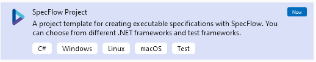
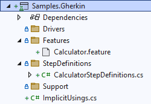
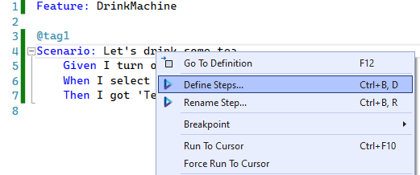
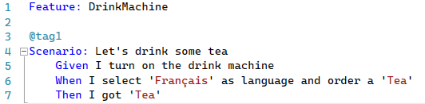
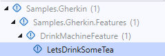

# Writing test cases - Gherkin Approach (C#/.NET)
In this article we will show you how to write test cases using Gherkin approach.
Gherkin approach is often used to test features in Behavior-Driven Development (for example: acceptance criteria of a user story) and in Agile environment. The test cases are represented by test scenarios written in gherkin language, and each sentence is implemented by code-behind. You can reuse the same sentence across the test project so the code-behind can also be reused.

With this method testers (or business users) and automation engineers can work together: One can maintain the repository of test scenarios in Gherkin and the other can maintain automation implementations. When a scenario is not yet automated, it can still be served for manual execution.

> [!NOTE]
> Gherkin approach is perfect for feature testing combined with BDD (Behavior-Driven Development).
> 
> But it may not be suitable for complex end-to-end tests. For this use cases, Gherkin scenarios may be too long, and the code-behind of each phrase may be difficult to maintain.
> For complex end-to-end tests, you may consider Keyword-driven/Data-driven testing approach.

## Prerequisites for Gherkin Approach
Using Visual Studio as development environment, you'll need to install `SpecFlow` extension in order to create test projects.

### Step 1: Create SpecFlow project
To initialize a test project using Gherkin, create a SpecFlow project:

SpecFlow is based on top of Unit Test framework, so the execution experience will be very similar. Once a SpecFlow project is created, it initializes the structure as follows: 

* In `Features` folder, test scenarios written in Gherkin Language and saved in `.features` file.
* In `StepDefinitions`, the implementation of these scenarios by code.
Let's delete the files in the folder Features and StepDefinitions and create our scenarios later.

### Step 2: Observe SUT and identify UI Elements
Observing system under test via Developer tools provided with browser. Here in our tutorial, we will operate 3 elements, to benefits the advantages from the Framework, we will put these 3 elements into a `PageModel`.

This is exactly the same step we've discussed in Linear Script Approach. Please refer to
[Observe SUT and Identify UI Elements](linear-script-cs.md#step-3-observe-sut-and-identify-ui-elements) for more information.

### Step 3: Write test scenarios (.feature)
Create a SpecFlow Feature file and name it `DrinkMachine.feature`, place it under the folder `Features`

Let's create our first scenario in Gherkin to order the Tea. 
[!code-gherkin[Main](../../Samples.Gherkin/Features/DrinkMachine.feature "DrinkMachine")]

There is no limit how to write the scenario using the keywords given-when-then. But generally, people often use `Given` to specify the preconditions, `When` to specify actions and `Then` to specify expected results. Following the same naming convention across teams can ensure good understanding of scenarios for all stakeholders.

### Step 4: Generate test steps from features
Once the feature is written, `Build` the project so SpecFlow add-in can generates necessary codes.
Then, in the feature file, right-click on the scenario and select `define steps`

It will automatically generate code to match each sentence:

We can see the `Variables` of the scenario is automatically recognized. (If that's not the case, you'll need to adjust the regular expression above the function and the arguments of the function.)
Now build the test project again, you can see the variables of the test is highlighted. That means we can reuse the same sentence and changing the test data in other test scenarios without the need to rewrite code-behind.

Now we are ready to write test scripts.

### Step 5: Implementation
From here, we'll need to use functionalities provided in WebEngine to implement automated tests. Here we will open the code `DrinkMachineStepDefinitions` generated from Step 4.

Make sure following NuGet Packages of WebEngine are installed in the test project:
* `AxaFrance.WebEngine`: for basic data structures
* `AxaFrance.WebEngine.Web`: for Web Applications running on Desktop and Mobile Devices
* `AxaFrance.WebEngine.MobileApp`: Required only if you are testing native or hybrid mobile applications

In this tutorial, the implementation will be as follow:
* In *Turn on drink machine* step, we initialize Selenium WebDriver via <xref:AxaFrance.WebEngine.Web.BrowserFactory> and navigate to the application.
* In *select language and order* step, we manipulate the SUT via page model
* In *then* step, we use `Assertion` to verify expected result
* At last, a *Cleanup* function tagged with `AfterSceario` to close the browser and Selenium WebDriver

Code snippets:
[!code-csharp[Main](../../Samples.Gherkin/StepDefinitions/DrinkMachineStepDefinitions.cs "DrinkMachineStepDefinition.cs")]

### Step 6: Run test case
Build your test project and go to *Test* -> *Test Explorer*: The scenario is listed in Test Explorer and you can now debug and run this automated test.

