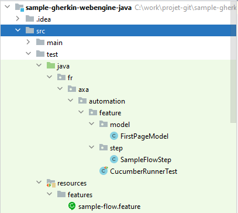
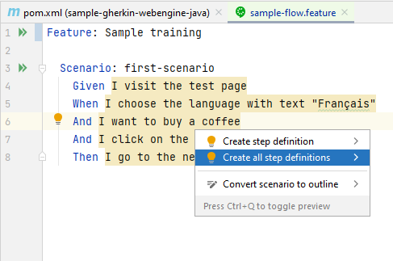
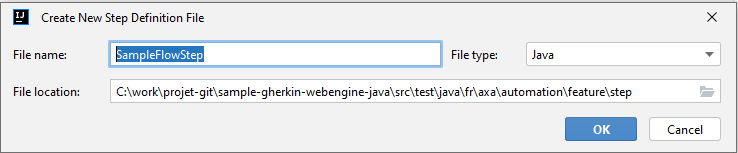
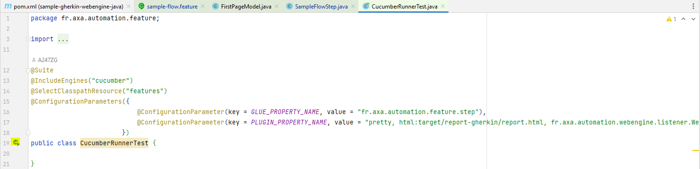
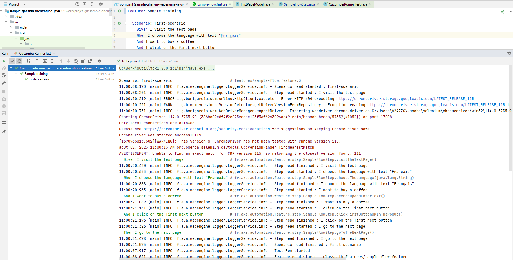

# Writing test cases - Gherkin Approach (Java / Spring boot)
In this article we will show you how to write test cases using Gherkin approach.
Gherkin approach is often used to test features in Behavior-Driven Development (for example: acceptance criteria of a user story) and in Agile environment. The test cases are represented by test scenarios written in gherkin language, and each sentence is implemented by code-behind. You can reuse the same sentence across the test project so the code-behind can also be reused.

With this method, testers (or business users) and automation engineers can work together: One can maintain the repository of test scenarios in Gherkin and the other can maintain automation implementations. When a scenario is not yet automated, it can still be served for manual execution.

> [!NOTE]
> Gherkin approach is perfect for feature testing combined with BDD (Behavior-Driven Development).
>
> But it may not be suitable for complex end-to-end tests. For this use cases, Gherkin scenarios may be too long, and the code-behind of each phrase may be difficult to maintain.
> For complex end-to-end tests, you may consider Keyword-driven/Data-driven testing approach.


### Step 1: Prerequisites for Gherkin Approach

JDK 8, maven and lombok

### Step 2: Create a simple maven project
Open pom.xml paste below code

```xml
<?xml version="1.0" encoding="UTF-8"?>
<project xmlns="http://maven.apache.org/POM/4.0.0" xmlns:xsi="http://www.w3.org/2001/XMLSchema-instance" xsi:schemaLocation="http://maven.apache.org/POM/4.0.0 http://maven.apache.org/xsd/maven-4.0.0.xsd">

  <modelVersion>4.0.0</modelVersion>

  <groupId>fr.axa.automation.webengine</groupId>
  <artifactId>sample-gherkin-webengine-java</artifactId>
  <version>1.0.0-SNAPSHOT</version>
  <packaging>jar</packaging>
  <name>sample-gherkin-webengine-java</name>

  <properties>
    <maven-compiler-plugin.version>3.10.1</maven-compiler-plugin.version>
    <maven-surefire-plugin.version>3.0.0-M7</maven-surefire-plugin.version>
    <webengine-boot-gherkin.version>3.0.0-SNAPSHOT</webengine-boot-gherkin.version>
  </properties>

  <dependencies>

    <dependency>
      <groupId>fr.axa.automation.webengine</groupId>
      <artifactId>webengine-boot-gherkin</artifactId>
      <version>${webengine-boot-gherkin.version}</version>
    </dependency>

  </dependencies>

  <build>
    <plugins>
      <plugin>
        <groupId>org.apache.maven.plugins</groupId>
        <artifactId>maven-compiler-plugin</artifactId>
        <version>${maven-compiler-plugin.version}</version>
      </plugin>

      <plugin>
        <groupId>org.apache.maven.plugins</groupId>
        <artifactId>maven-surefire-plugin</artifactId>
        <version>${maven-surefire-plugin.version}</version>
      </plugin>

    </plugins>
  </build>
</project>
```

For your information, we use junit 5 with the framework

### Step 3: Project structure


* In `Features` folder, test scenarios written in Gherkin Language and saved in `.features` file.
* In `step`, the implementation of these scenarios by code.
* In `model`, the page model.
* CucumberRunnerTest : Runner for executing tests
  


### Step 4: Observe SUT and identify UI Elements
Observing system under test from Developer tools provided with browser. Here in our tutorial, we will operate 3 elements, to benefits the advantages of the Framework, we will put these 3 elements into a `PageModel`.


This is exactly the same step we've discussed in Linear Script Approach. Please refer to
[Observe SUT and Identify UI Elements](linear-script-cs.md#step-3-observe-sut-and-identify-ui-elements) for more information.

### Step 5: Write test scenarios (.feature)
Create a Feature file and name it `sample-flow.feature`, place it under the folder `features`
Paste this below code :

```feature
Feature: Sample training

  Scenario: first-scenario
    Given I visit the test page
    When I choose the language with text "Français"
    And I want to buy a coffee
    And I click on the first next button
    Then I go to the next page
```

There is no limit how to write the scenario using the keywords given-when-then. But generally, people often use `Given` to specify the preconditions, `When` to specify actions and `Then` to specify expected results. 
Following the same naming convention across teams can ensure good understanding of scenarios for all stakeholders.

### Step 6: Generate test steps from features
Once the feature is written, place the caret at a step in your .feature file and press Alt + Enter.



Name the java class: SampleFlowStep.java


It will automatically generate code to match each sentence:

```java
package fr.axa.automation.feature.step;

import io.cucumber.java.en.And;
import io.cucumber.java.en.Given;
import io.cucumber.java.en.Then;
import io.cucumber.java.en.When;

public class SampleFlowStep {
@Given("I visit the test page")
public void iVisitTheTestPage() {
}

    @When("I choose the language with text {string}")
    public void iChooseTheLanguageWithText(String arg0) {
    }

    @And("I want to buy a coffee")
    public void iWantToBuyACoffee() {
    }

    @And("I click on the first next button")
    public void iClickOnTheFirstNextButton() {
    }

    @Then("I go to the next page")
    public void iGoToTheNextPage() {
    }
}
```


### Step 5: Complete the code for using page model and browser factory

Create the page model :

```java
package fr.axa.automation.feature.model;

import fr.axa.automation.webengine.core.AbstractPageModel;
import fr.axa.automation.webengine.core.WebElementDescription;
import lombok.AccessLevel;
import lombok.Getter;
import lombok.experimental.FieldDefaults;
import org.openqa.selenium.WebDriver;


@FieldDefaults(level = AccessLevel.PUBLIC)
public class FirstPageModel extends AbstractPageModel {

    @Getter
    WebElementDescription language = WebElementDescription.builder().tagName("select").id("language").build();

    @Getter
    WebElementDescription coffeeRadio = WebElementDescription.builder().tagName("input").id("coffee").build();

    @Getter
    WebElementDescription teaRadio = WebElementDescription.builder().tagName("input").id("tea").build();

    @Getter
    WebElementDescription waterRadio = WebElementDescription.builder().tagName("input").id("water").build();

    @Getter
    WebElementDescription nextStep = WebElementDescription.builder().tagName("button").xPath(".//button[contains(text(),\"Next (3-second-delay)\")]").build();

    public FirstPageModel(WebDriver webDriver) throws Exception {
        populateDriver(webDriver);
    }
}
```

Complete the SampleFlowStep class

```java
package fr.axa.automation.feature.step;

import fr.axa.automation.feature.model.FirstPageModel;
import fr.axa.automation.webengine.helper.WebdriverHelper;
import fr.axa.automation.webengine.step.AbstractStep;
import io.cucumber.java.en.And;
import io.cucumber.java.en.Given;
import io.cucumber.java.en.Then;
import lombok.AccessLevel;
import lombok.Getter;
import lombok.experimental.FieldDefaults;
import org.openqa.selenium.WebDriver;

@Getter
@FieldDefaults(level = AccessLevel.PROTECTED)
public class SampleFlowStep extends AbstractStep {

    WebDriver driver;
    FirstPageModel firstPageModel;

    public SampleFlowStep() throws Exception {
        driver = WebdriverHelper.initializeDriver();
        firstPageModel = new FirstPageModel(driver);
    }

    @Given("^I visit the test page$")
    public void visitTheTestPage() throws InterruptedException {
        addInformation("Open WebEngine test page");
        driver.get("http://webengine-test.azurewebsites.net/Step1.html");
    }

    @And("^I choose the language with text \"([^\"]*)\"$")
    public void chooseTheLanguage(String language) throws Exception {
        addInformation("Choose the language");
        getFirstPageModel().getLanguage().selectByText(language);
    }

    @And("^I want to buy a coffee$")
    public void seePopUpAndEnterText() throws Exception {
        getFirstPageModel().getCoffeeRadio().click();
    }

    @And("^I click on the first next button$")
    public void clickFirstButtonOKInThePopup() throws Exception {
        getFirstPageModel().getNextStep().click();
    }

    @Then("^I go to the next page$")
    public void goToTheNextPage() {
        addInformation("Success");
        getDriver().close();
    }
}
```

### Step 7: Create the runner class
``` java
package fr.axa.automation.feature;

import org.junit.platform.suite.api.ConfigurationParameter;
import org.junit.platform.suite.api.ConfigurationParameters;
import org.junit.platform.suite.api.IncludeEngines;
import org.junit.platform.suite.api.SelectClasspathResource;
import org.junit.platform.suite.api.Suite;

import static io.cucumber.junit.platform.engine.Constants.GLUE_PROPERTY_NAME;
import static io.cucumber.junit.platform.engine.Constants.PLUGIN_PROPERTY_NAME;

@Suite
@IncludeEngines("cucumber")
@SelectClasspathResource("features")
@ConfigurationParameters({
                            @ConfigurationParameter(key = GLUE_PROPERTY_NAME, value = "fr.axa.automation.feature.step"),
                            @ConfigurationParameter(key = PLUGIN_PROPERTY_NAME, value = "pretty, html:target/report-gherkin/report.html, fr.axa.automation.webengine.listener.WebengineReportListener, json:target/cucumber-report/cucumber.json")
                        })
public class CucumberRunnerTest {

}
```

### Step 6: Run test case
Run :


Result :

