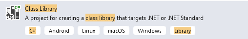

# Keyword-Driven testing Approach (C#/.NET)
This article will show steps to build an Automation Solution based on Keyword-Driven testing approach with WebEngine Framework.
Please refer to [Keyword-Driven testing approach](keyworddriven.md) for more information about this approach.

Considering we are building a Test Automation Solution for Home Insurance Underwriting application: http://webengine-test.azurewebsites.net/home-insurance

## Step 1: Analyzing and Modelling
In this step, we analyze application under test, create use cases and high-level actions (keywords), note that these actions can be possibly reused in different test cases.

For example, we can separate the insurance underwriting scenario into several high-level action keywords: 
* Login
* Search Prospect
* Underwriting
* Choose offer and options
* Validate contract
* Logout

For underwriting, there will be 3 steps:
* Home location
* Details based on type of home: **Apartment** or **House**.
* And antecedents if it happened

The modelling of Home Insurance Underwriting application may look like following diagram:

Along with the modelling, it is necessary to define also test data to be used for each action keyword. these Test datas are manipulated in the application under test and also verify expected result.

## Step 2: Initializing test project with WebEngine Framework
### 2.1 Create a class library project
Create a new class library with Visual Studio.

> [!NOTE]
> The project type can be `Class Library (.NET Framework)` based on .NET 4.8. or `Class Library` based on .NET Core

### 2.2 Install required NuGet Packages
To build test automation solutions with keyword-driven testing approach, you'll need the following components:
* `AxaFrance.WebEngine` - Required
* `AxaFrance.WebEngine.Web` - Required
* `AxaFrance.WebEngine.Runner` - Required
* `AxaFrance.WebEngine.MobileApp` - Optional, for Native Android and iOS applications only
* `AxaFrance.WebEngine.ReportViewer` - Optional, make it possible to view the report locally.

### 2.3 Initialize project structure
A typical WebEngine test project has following structures:
<table>
<tr>
<td width="40%" style="text-align:center">

</td>
<td>

#### Actions
This folder contains all Action Keywords.

#### Page Models
This folder contains all page models.
It is recommended to create one page model per web page (or screen).
If a web page has too many UI elements to manipulate during the test, they can also be stored in different page models.

#### Test Cases
Defines test cases by reusing action keywords.
A test case can be reused multiple times by giving different test data (combination with Data-driven approach)

#### Test Suite
The entry point of the test project. It lists the test cases should be executed.
</td>
</tr>
</table>

### 2.4 Define page models
Similar to other methods, it is recommended to use Page model to separate object identification and test script. 

Please refer to [Organize UI Elements with Page Model](page-model.md)
* For Web application, use [WebElementDescription](web-elements.md)
* For Native mobile app, use [AppElementDescription](app-elements.md)

In this example, we will define one model per page.
* Please refer to section [Implementing Login keyword](#implementing-login-keyword)

### 2.5 Define test cases
Test case is inherited from <xref:AxaFrance.WebEngine.Web.TestCaseWeb> to have common web testing behaviors such as: Checks WebDriver, Open the browser before the test and close the browser after test.
And defines which keywords will be executed one after another. As per modelling, the test case will seem to the following code snippet: 

 [!code-csharp[Main](../../Samples.KeywordDriven/TestCases/TC_InsuranceQuote.cs "Test Case")]

## Step 3: Develop test scripts
Now we are entering to the most interesting part: develop test scripts. That is, implementing each action keyword with test script. In this article, we will show the implementation of 2 keywords:
`Login` and `Underwriting`

`Login` is a normal keyword doing following actions:
* Connect to the application.
* Fill username in the textbox
* Fill password in the textbox
* Click on "Login" button
* Check the login is success

This action needs 3 parameters: `URL` of the application, `Username` and `Password`

`Underwriting` is a complex action keyword. To improve readability and maintainability of the solution, this keyword will be separated into 3 sub-actions.

> [!NOTE]
> In this tutorial, we will use hard coded test data for demonstration.
>
> Externalized test data and dynamic test suite will be discussed in [Data-Driven testing approach](data-driven-cs.md)

### Implementing `Login` keyword
To implement Login Keyword, we'll need to analyze the login page.
# [Web Page](#tab/webpage-login)
In this action keyword, the script will need to access 3 Web Elements: username, password, and login button and **important** the fourth one: error message.

Use `Developer Tools` of the browser, lets create a Page Model `PageLogin.cs`

# [Page Model](#tab/model-login)
This is the code snippet of `PageLogin.cs`. As we can see, by using element description, There is less need to comment everything if the name of the Page Model and the Web Elements are well named. 

[!code-csharp[Main](../../Samples.KeywordDriven/PageModels/PageLogin.cs "Test Case")]
The page model will be used in action keyword `Login.cs`

# [Action Keyword](#tab/action-login)
In the script of action keyword we navigate to the Url of the application.
Then initialize a new instance of page model by given it the active WebDriver object.
Then fill login, password to the click login button and verify there is no error message.

All action keyword must inherit from <xref:AxaFrance.WebEngine.SharedActionBase>. For Web based keyword, inherit from <xref:AxaFrance.WebEngine.Web.SharedActionWeb>, then implement `DoAction` and `DoCheckpoint` methods.

[!code-csharp[Main](../../Samples.KeywordDriven/Actions/Login.cs "Test Case")]
***

### Implementing `Underwriting` keyword

Underwriting keyword is complex, because we need to enter a lot of data in the form to get an insurance quote. So, We'll want to simplify the subject by separate this keyword into several sub-level keywords:
* Specify Home Location
* Fill home details according to the type (House or Apartment)
* Fill antecedents (accidents previously declared)

# [Underwriting Action](#tab/action-underwriting)
As we can see, the implementation of this underwriting is just to dispatch to sub-actions. Now you can implement each sub-actions which is much more easier to do.
[!code-csharp[Main](../../Samples.KeywordDriven/Actions/Underwriting.cs "Unterwriting")]

# [HomeLocation Action](#tab/home-location)
Home location sub-action is called by Underwriting action. Sub-action can be used when the keyword action is too complexe.

[!code-csharp[Main](../../Samples.KeywordDriven/Actions/HomeLocation.cs "Home Location")]

# [HomeDetails Action](#tab/home-details)
Home Details sub-action is called by Underwriting action. Sub-action can be used when the keyword action is too complexe. As you can see, this action calls another sub-action according to the type of home (Apartment or House)

[!code-csharp[Main](../../Samples.KeywordDriven/Actions/HomeDetails.cs "Test Case")]

# [Antecedentes Action](#tab/antecedentes)
[!code-csharp[Main](../../Samples.KeywordDriven/Actions/Antecedents.cs "Test Case")]
***

We can now use this technique to implement other action keywords and create page models if necessary.

## Step 4: Define Test Suite
A test suite defines a list of test cases to be executed.
One Test Case can be used multiple times with different test data.
Only one `TestSuite` per project is allowed.

In this example, We don't use externalized test data, all test data is hard coded in the keyword action.
In this case we will provide a hard-coded list of test cases with name:

[!code-csharp[Main](../../Samples.KeywordDriven/TestSuite.cs "Test Case")]

> [!NOTE]
> Using hard coded test data and hard coded test case list is only for demonstration.
> In the real project, it is strongly recommanded to use variables in each keyword and run tests dynamically driven by external data. 
> Please refer to [Data-Driven Test Approach](data-driven-cs.md) after finished this tutoriel.

## Step 5: Debug and Execute
To launch or debug your solution, you'll need to configue the project properties to launch `WebRunner` with appropriate parameters.

Then you can set breakpoint in the code to debug step by step.
For more information about `WebRunner` please refers to [WebRunner](../articles/webrunner.md)

> [!NOTE]
> When test data is externalized, you can run test cases dynamically from Excel via WebEngine Addin for Excel.
> For more information about Excel Add-in, please refer to [Working with WebEngine Add-in for Excel](../articles/excel-addin.md)

## Visualize Reports
After execution, the log will be generated in indicated folder. You can open it with `ReportViewer` to see the structure, details and even screenshots:

When running tests with `WebRunner` you can add `-showReport` to start ReportViwer after test execution.

## Resume
As you can see, with this method it takes longer to automatize the first test case. But in long term, you have a well structured, modelized testing project that makes easier to improve and to maintain. We recommand this approach for complex end-to-end scenarios.

BUT, it's not finished. In this tutorial, everything is hard-coded:
* Url is hard coded, you may want to test under multiple test-environments
* Test data is hard coded, you may want to run the test case with other combination of test data
* Test suite is hard coded, you may want to execute one, more or all test cases according to the need.
* Logic is hard coded, you may want to change some logic of script based on the test data.
In next article [Data-Driven Approach](data-driven-cs.md), we'll convert all these hard coded things dynamically.

> [!NOTE]
> The example project of this article can be found in Samples.KeywordDriven
