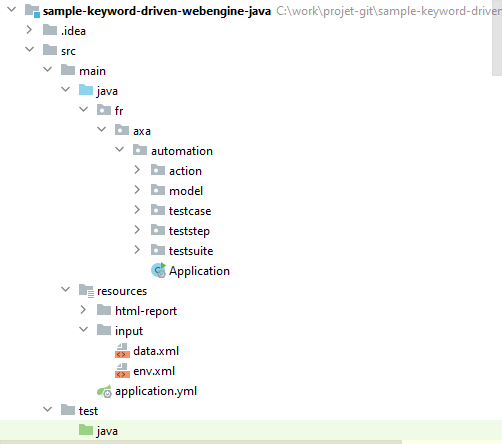
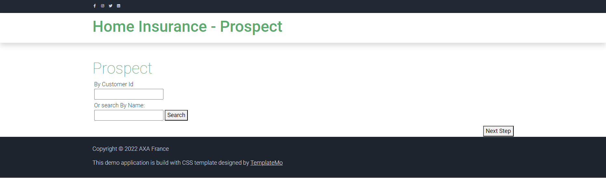
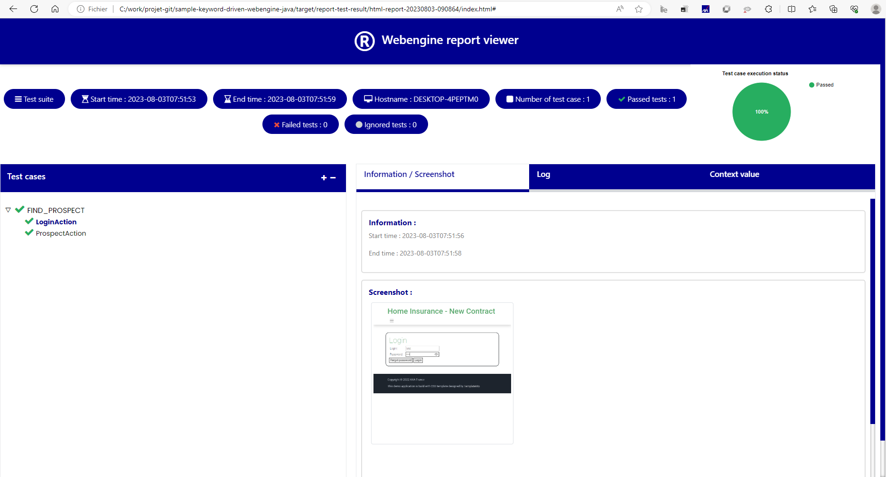

# Keyword-Driven testing Approach (Java/Spring boot)
This article will show steps to build an Automation Solution based on Keyword-Driven testing approach with WebEngine Framework.
Please refer to [Keyword-Driven testing approach](keyworddriven.md) for more information about this approach.

Considering we are building a Test Automation Solution for Home Insurance Underwriting application: http://webengine-test.azurewebsites.net/home-insurance

## Step 1: Analyzing and Modelling
In this step, we analyze application under test, create use cases and high-level actions (keywords), note that these actions can be possibly reused in different test cases.

For example, we can separate the insurance underwriting scenario into several high-level action keywords:
* Login
* Search Prospect
* Underwriting
* Choose offer and options
* Validate contract
* Logout

For underwriting, there will be 3 steps:
* Home location
* Details based on type of home: **Apartment** or **House**.
* And antecedents if it happened

The modelling of Home Insurance Underwriting application may look like following diagram:


Along with the modelling, it is necessary to define also test data to be used for each action keyword. these Test datas are manipulated in the application under test and also verify expected result.

## Step 2: Prerequisites for Keyword-Driven Approach

JDK 8, maven and lombok


## Step 3: Create a simple maven project

Open pom.xml paste below code

```xml
<?xml version="1.0" encoding="UTF-8"?>
<project xmlns="http://maven.apache.org/POM/4.0.0" xmlns:xsi="http://www.w3.org/2001/XMLSchema-instance" xsi:schemaLocation="http://maven.apache.org/POM/4.0.0 http://maven.apache.org/xsd/maven-4.0.0.xsd">

<modelVersion>4.0.0</modelVersion>

<groupId>fr.axa.automation</groupId>
<artifactId>sample-keyword-driven-webengine-java</artifactId>
<version>1.0.0-SNAPSHOT</version>
<packaging>jar</packaging>
<name>sample-keyword-driven-webengine-java</name>

  <properties>
    <project.build.sourceEncoding>UTF-8</project.build.sourceEncoding>
    <start-class>fr.axa.automation.Application</start-class>

    <spring-boot-starter.version>2.2.0.RELEASE</spring-boot-starter.version>

    <spring-boot-maven-plugin.version>2.5.4</spring-boot-maven-plugin.version>
    <maven-compiler-plugin.version>3.10.1</maven-compiler-plugin.version>
    <maven-surefire-plugin.version>3.0.0-M7</maven-surefire-plugin.version>
    <webengine-boot-keyword-driven.version>2.2.0</webengine-boot-keyword-driven.version>
  </properties>

  <dependencies>

    <dependency>
      <groupId>fr.axa.automation.webengine</groupId>
      <artifactId>webengine-boot-keyword-driven</artifactId>
      <version>${webengine-boot-keyword-driven.version}</version>
    </dependency>

  </dependencies>

  <dependencyManagement>
    <dependencies>
      <dependency>
        <!-- Import dependency management from Spring Boot -->
        <groupId>org.springframework.boot</groupId>
        <artifactId>spring-boot-starter-parent</artifactId>
        <version>${spring-boot-starter.version}</version>
        <type>pom</type>
        <scope>import</scope>
      </dependency>
    </dependencies>
  </dependencyManagement>

  <build>
    <plugins>

      <plugin>
        <groupId>org.apache.maven.plugins</groupId>
        <artifactId>maven-compiler-plugin</artifactId>
        <version>${maven-compiler-plugin.version}</version>
      </plugin>

      <plugin>
        <groupId>org.springframework.boot</groupId>
        <artifactId>spring-boot-maven-plugin</artifactId>
        <version>${spring-boot-maven-plugin.version}</version>
        <configuration>
          <mainClass>${start-class}</mainClass>
          <classifier>exec</classifier>
          <excludeDevtools>true</excludeDevtools>
        </configuration>
        <executions>
          <execution>
            <goals>
              <goal>repackage</goal>
            </goals>
          </execution>
        </executions>
      </plugin>

      <plugin>
        <groupId>org.apache.maven.plugins</groupId>
        <artifactId>maven-surefire-plugin</artifactId>
        <version>${maven-surefire-plugin.version}</version>
        <configuration>
          <useSystemClassLoader>false</useSystemClassLoader>
        </configuration>
      </plugin>

      <plugin>
        <groupId>org.apache.maven.plugins</groupId>
        <artifactId>maven-dependency-plugin</artifactId>
        <executions>
          <execution>
            <id>unpack</id>
            <phase>generate-resources</phase>
            <goals>
              <goal>unpack</goal>
            </goals>
            <configuration>
              <artifactItems>
                <artifactItem>
                  <groupId>fr.axa.automation.webengine</groupId>
                  <artifactId>webengine-report</artifactId>
                  <version>3.0.0-SNAPSHOT</version>
                  <type>jar</type>
                  <includes>html-report/**</includes>
                  <outputDirectory>${basedir}/src/main/resources/</outputDirectory>
                </artifactItem>
              </artifactItems>
            </configuration>
          </execution>
        </executions>
      </plugin>

    </plugins>
    <pluginManagement>
      <plugins />
    </pluginManagement>
  </build>
</project>
```

> [!NOTE]
> Run the command "mvn clean install -U"

## Step 3:  Initialize project structure
A typical WebEngine test project has following structures:
<table>
<tr>
<td width="40%" style="text-align:center">




</td>
<td>

#### model
This folder contains all page models.
It is recommended to create one page model per web page (or screen).
If a web page has too many UI elements to manipulate during the test, they can also be stored in different page models.

#### action
This folder contains all Action Keywords.

#### teststep
Test step associated to action.

#### testcase
Defines test cases by reusing action keywords.
A test case can be reused multiple times by giving different test data (combination with Data-driven approach)

#### Testsuite
The entry point of the test project. It lists the test cases should be executed.

</td>
</tr>
</table>

## Step 4: Define page models
Similar to other methods, it is recommended to use Page model to separate object identification and test script.

Please refer to [Organize UI Elements with Page Model](page-model.md)
* For Web application, use [WebElementDescription](web-elements.md)

[//]: # (* For Native mobile app, use [AppElementDescription]&#40;app-elements.md&#41;)

In this example, we will define one model per page.
* Please refer to section [Implementing Login keyword](#implementing-login-keyword)


# [Login page model](#tab/login-page-model)
```java
package fr.axa.automation.model;

import fr.axa.automation.webengine.core.AbstractPageModel;
import fr.axa.automation.webengine.core.WebElementDescription;
import lombok.AccessLevel;
import lombok.Getter;
import lombok.experimental.FieldDefaults;
import org.openqa.selenium.WebDriver;


@FieldDefaults(level = AccessLevel.PUBLIC)
public class LoginModel extends AbstractPageModel {

    @Getter
    WebElementDescription login = WebElementDescription.builder().tagName("input").name("login").build();

    @Getter
    WebElementDescription password = WebElementDescription.builder().tagName("input").name("password").build();

    @Getter
    WebElementDescription button = WebElementDescription.builder().tagName("button").innerText("Login").build();

    public LoginModel(WebDriver webDriver) throws Exception {
        populateDriver(webDriver);
    }
}
```

# [search prospect page model](#tab/search-prospect-page-model)
```java
package fr.axa.automation.model;

import fr.axa.automation.webengine.core.AbstractPageModel;
import fr.axa.automation.webengine.core.WebElementDescription;
import lombok.AccessLevel;
import lombok.Getter;
import lombok.experimental.FieldDefaults;
import org.openqa.selenium.WebDriver;


@FieldDefaults(level = AccessLevel.PUBLIC)
public class ProspectModel extends AbstractPageModel {

    @Getter
    WebElementDescription customerId = WebElementDescription.builder().tagName("input").id("prospectId").build();

    @Getter
    WebElementDescription customerName = WebElementDescription.builder().tagName("input").name("prospectName").build();

    @Getter
    WebElementDescription searchName = WebElementDescription.builder().xPath("/html/body/div/div[2]/button").build();

    public ProspectModel(WebDriver webDriver) throws Exception {
        populateDriver(webDriver);
    }
}
```
***

## Step 5: Develop test scripts
Now we are entering to the most interesting part: develop test scripts. 
That is, implementing each action keyword with test script. In this article, we will show the implementation of 2 keywords:
`Login` and `searching module`

`Login` is a normal keyword doing following actions:
* Connect to the application.
* Fill username in the textbox
* Fill password in the textbox
* Click on "Login" button
* Check the login is success

This action needs 3 parameters: `URL` of the application, `Username` and `Password`

`searching module` is a page for searching customer : 
Enter the name or id of customer
Click on the "search" button 

> [!NOTE]
> In this tutorial, we will use hard coded test data for demonstration.
>
> Externalized test data and dynamic test suite will be discussed in [Data-Driven testing approach](data-driven-cs.md)

### Implementing `Login` keyword

# [Login page](#tab/login-page)


# [Login action](#tab/login-action)
```java
package fr.axa.automation.action;

import fr.axa.automation.model.LoginModel;
import fr.axa.automation.webengine.core.AbstractActionWebBase;
import lombok.AccessLevel;
import lombok.experimental.FieldDefaults;

@FieldDefaults(level = AccessLevel.PRIVATE)
public class LoginAction extends AbstractActionWebBase {
    LoginModel loginModel;

    public LoginAction() {
    }

    @Override
    public void doAction() throws Exception {
        loginModel = new LoginModel(getWebDriver());
        getWebDriver().get("http://webengine-test.azurewebsites.net/home-insurance/");
        loginModel.getLogin().sendKeys("test");
        loginModel.getPassword().sendKeys("test");
        screenShot();
        loginModel.getButton().click();
        addInformation("First step succeed");
    }

    @Override
    public boolean doCheckpoint() throws Exception {
        return true;
    }
}
```

# [Login step](#tab/login-step)

```java
package fr.axa.automation.teststep;

import fr.axa.automation.action.LoginAction;
import fr.axa.automation.webengine.core.IAction;
import fr.axa.automation.webengine.core.ITestStep;

public class LoginStep implements ITestStep {
  @Override
  public Class<? extends IAction> getAction() {
      return LoginAction.class;   
  }
}
```
***

### Implementing `searching module` keyword

# [Searching module page](#tab/searching-module-page)



# [Searching module action](#tab/searching-module-action)

```java
package fr.axa.automation.action;

import fr.axa.automation.model.ProspectModel;
import fr.axa.automation.webengine.core.AbstractActionWebBase;
import lombok.AccessLevel;
import lombok.experimental.FieldDefaults;

@FieldDefaults(level = AccessLevel.PRIVATE)
public class ProspectAction extends AbstractActionWebBase {
  ProspectModel prospectModel;

  public ProspectAction() {
  }

  @Override
  public void doAction() throws Exception {
    prospectModel = new ProspectModel(getWebDriver());
    prospectModel.getCustomerName().sendKeys("Nicolas");
    prospectModel.getSearchName().click();
    screenShot();
    addInformation("Prospect step succeed");
  }

  @Override
  public boolean doCheckpoint() throws Exception {
    return true;
  }
}
```

# [Searching module step](#tab/searching-module-step)

```java
package fr.axa.automation.teststep;


import fr.axa.automation.action.ProspectAction;
import fr.axa.automation.webengine.core.IAction;
import fr.axa.automation.webengine.core.ITestStep;

public class ProspectStep implements ITestStep {
    @Override
    public Class<? extends IAction> getAction() {        
        return ProspectAction.class;
    }
}
```
***

## Step 6: Define test cases
Test case is inherited from "fr.axa.automation.webengine.core.ITestCase" to have common web testing behaviors such as: Checks WebDriver, Open the browser before the test and close the browser after test.
And defines which keywords will be executed one after another. As per modelling, the test case will seem to the following code snippet:

```java
package fr.axa.automation.testcase;

import fr.axa.automation.teststep.LoginStep;
import fr.axa.automation.teststep.ProspectStep;
import fr.axa.automation.webengine.core.ITestCase;
import fr.axa.automation.webengine.core.ITestStep;

import java.util.Arrays;
import java.util.List;

public class FindProspectTestCase implements ITestCase {

    @Override
    public List<? extends ITestStep> getTestStepList() {
        return Arrays.asList(   new LoginStep(),
                                new ProspectStep());
    }
}
```

## Step 7: Define Test Suite
A test suite defines a list of test cases to be executed.
One Test Case can be used multiple times with different test data.
Only one `TestSuite` per project is allowed.

In this example, We don't use externalized test data, all test data is hard coded in the keyword action.
In this case we will provide a hard-coded list of test cases with name:

```java
package fr.axa.automation.testsuite;

import fr.axa.automation.testcase.FindProspectTestCase;
import fr.axa.automation.webengine.core.AbstractTestSuite;
import fr.axa.automation.webengine.core.ITestCase;

import java.util.AbstractMap;
import java.util.ArrayList;
import java.util.List;

public class TestSuite extends AbstractTestSuite {

    public static final String FIND_PROSPECT_TEST_CASE = "FIND_PROSPECT"; //Test case defined in data.xml

    @Override
    public List<AbstractMap.SimpleEntry<String, ? extends ITestCase>> getTestCaseList() {
        List<AbstractMap.SimpleEntry<String, ? extends ITestCase>> testCaseList = new ArrayList();
        testCaseList.add(new AbstractMap.SimpleEntry<String, ITestCase>(FIND_PROSPECT_TEST_CASE,new FindProspectTestCase()));
        return testCaseList;
    }
}
```

> [!NOTE]
> Using hard coded test data and hard coded test case list is only for demonstration.
> In the real project, it is strongly recommanded to use variables in each keyword and run tests dynamically driven by external data.
> Please refer to [Data-Driven Test Approach](data-driven-cs.md) after finished this tutoriel.

## Step 8: Define application boot
This is the main class for running your solution.
You have just to copy and paste this below code.

```java
package fr.axa.automation;

import fr.axa.automation.webengine.boot.BootProject;
import fr.axa.automation.webengine.logger.LoggerService;
import org.springframework.beans.factory.annotation.Autowired;
import org.springframework.boot.CommandLineRunner;
import org.springframework.boot.WebApplicationType;
import org.springframework.boot.autoconfigure.SpringBootApplication;
import org.springframework.boot.builder.SpringApplicationBuilder;

@SpringBootApplication
public class Application implements CommandLineRunner {

    final LoggerService loggerService;

    final BootProject bootProject;

    @Autowired
    public Application(LoggerService loggerService, BootProject bootProject) {
        this.loggerService = loggerService;
        this.bootProject = bootProject;
    }

    public static void main(String[] args) {
        new SpringApplicationBuilder(Application.class).web(WebApplicationType.NONE).run(args);
    }

    @Override
    public void run(String... args) throws Exception {
        loggerService.info("Temporary directory application: "+System.getProperty("java.io.tmpdir"));
        bootProject.runFromProject(args);
    }
}
```


## Step 9: Execute the solution
Run the class Application

Then you can set breakpoint in the code to debug step by step.


> [!NOTE]
> When test data is externalized, you can run test cases dynamically from Excel via WebEngine Addin for Excel.
> For more information about Excel Add-in, please refer to [Working with WebEngine Add-in for Excel](../articles/excel-addin.md)

## Step 10: Visualize Reports
After execution, the log will be generated in indicated folder. You can open it with Edge to see details and even screenshots:



When running you can add `-showReport` to open HTML report after test execution.


## Resume
As you can see, with this method it takes longer to automatize the first test case. But in long term, you have a well structured, modelized testing project that makes easier to improve and to maintain. We recommand this approach for complex end-to-end scenarios.

BUT, it's not finished. In this tutorial, everything is hard-coded:
* Url is hard coded, you may want to test under multiple test-environments
* Test data is hard coded, you may want to run the test case with other combination of test data
* Test suite is hard coded, you may want to execute one, more or all test cases according to the need.
* Logic is hard coded, you may want to change some logic of script based on the test data.
  In next article [Data-Driven Approach](data-driven-cs.md), we'll convert all these hard coded things dynamically.

> [!NOTE]
> The example project of this article can be found in sample-keyword-driven
