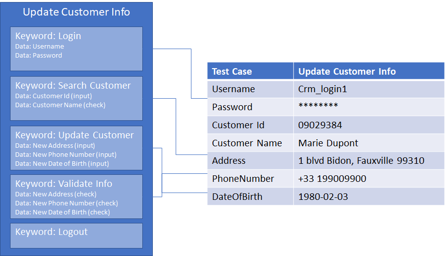

# Keyword-driven Testing approach

**Keyword-driven testing**, or **Action Keyword based testing** is a testing methodology separates the documentation of test cases into different action keywords.

The test case design process has also separated into 2 distinct steps:
- Test Process Modeling
- Test Script Development

## Test Process Modeling
In this process, you'll need to analyze the system under test (*SUT*) and define possible test cases and find out high-level test steps which can be reused among different test cases.

Assign each high-level test steps with **Action Keyword** or called **Keyword**. Each keyword represents a series of operations on *SUT* and necessary operations to verify the results. Each keyword has its own prerequisites, logic, and test data (for operation and verification), and implemented with code (script).

The whole test case will be finally represented as the series of action keywords and associated test data. If a keyword is still too complicated to implement, you can also divide a complex keyword into different less-complex keywords.

Test process modeling is important. If most of the keywords are reusable and understandable, it will reduce the necessary effort for the maintenance and evolution of the test automation solution.

## Test Script Development
Test Script development in Keyword-driven approach means developing every action keyword for a given test case:
* Checks its pre-conditions
* Controls the SUT
* Verifies expected result of the action keyword.
Then assembly these keywords to form a test case, with associated test data.
> [!NOTE]
> As keywords are reused among different test cases, test data is often parameterized or externalized. This approach is usually associated with Data-driven testing approach.

## Test Execution
Keyword driven test approach often combines with Data-Drive approach because keywords are made to be re-used in different scenarios.
During test execution, you'll need to provide test data for the test case (or, say the test data for each keyword used in the test case).

Test data is often externalized and associated with each test case. 
Keyword driven test frameworks will load test data for the test case then execute each keyword one after another.

In above example, we can see which test data is required for each keyword and how test data is provided for each test case.
