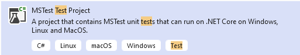
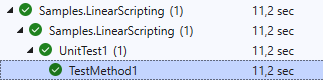

# Linear Scripting Approach (C#/.NET)
In this article we will show you how to write test cases using linear scripting approach.
Linear scripting approach is the most used approach in Unit Test and for simple test scenarios.
In this approach, test cases are interpreted directly into test scripts, the method is fast for writing simple test cases but does not guarantee reuse of the functionality and part of test script across test projects.

This tutorial is based on Unit Test Framework MsTest under Visual Studio 2022, if you are using NUnit or XUnit, or another development tool, the solution will be similar.

> [!NOTE]
> Linear scripting approach is easy and fast to implement.
>
> Linear scripting approach does not guarantee modeling and reuse. Please consider avoiding this approach for end-to-end tests, because it may be too complex to be evolved and maintained.

## Required Framework components
* `AxaFrance.WebEngine`: for basic data structures.
* `AxaFrance.WebEngine.Web`: for Web Applications running on Desktop and Mobile Devices.
* `AxaFrance.WebEngine.MobileApp`: Required only if you are testing native or hybrid mobile applications.

Other components of WebEngine Framework is not used.

## Steps to build Test Automation Solution using Linear Scripting
### Step 1: Create a Test Project
Using Visual Studio and Create a MSTest Project, bane it `Samples.LinearScripting`.
You can use any recent versions of .NET (`.NET Framework 4.8` or `.NET 6.0` for example)



And empty test project is then created. with a class called `UnitTest1`
```csharp
namespace Samples.LinearScripting
{
    [TestClass]
    public class UnitTest1
    {
        [TestMethod]
        public void TestMethod1()
        {
        }
    }
}
```
Now we can build our test scripts based on Selenium. Our system under test is the application: http://webengine-test.azurewebsites.net/Step1.html

After the project initialization, you need to install the NuGet Package:
* AxaFrance.WebEngine
* AxaFrance.WebEngine.Web
* Selenium WebDriver (>= 4.1.0)
* Appium.WebDriver (>= 5.0.0-beta01) (for beta version of Appium you'll need to check "include prerelease" in NuGet Package Manager)

### Step 2: Write Setup and Teardown
In this step, we will write `Setup` and `Teardown` functions to initialize test environment before each test case and cleanup the test results after each test case.

* Setup: Initializes the WebDriver object.
* Teardown: Closes the driver and the browser.

To do this, insert following code to `UnitTest.cs`
```csharp
using OpenQA.Selenium;

namespace Samples.LinearScripting
{
    [TestClass]
    public class UnitTest1
    {
        //WebDriver object will be used for each test case.
        WebDriver? driver = null;

        [TestInitialize]
        public void Setup()
        {
            //Initialize the driver by platform and browser type, then open test application
            driver = AxaFrance.WebEngine.Web.BrowserFactory.GetDriver(AxaFrance.WebEngine.Platform.Windows, AxaFrance.WebEngine.BrowserType.Chrome);
            driver.Navigate().GoToUrl("https://webengine-test.azurewebsites.net/Step1.html");
        }

        [TestCleanup]
        public void Teardown()
        {
            //Close the driver (and browser) after each test case.
            driver?.Close();
            driver?.Dispose();
        }

        [TestMethod]
        public void TestMethod1()
        {
            //Here will be the test script.
        }
    }
}
```

### Step 3: Observe SUT and identify UI Elements

Observing system under test from Developer tools provided with browser. Here in our tutorial, we will operate 3 elements, to benefits the advantages from the Framework, we will put these 3 elements into a `PageModel`.


When identifying an UI Element, we can combine multiple locators to make sure they can select only the element we want:

* The dropdown list "Choose Language" can be identified by `TagName = "select"` and `id="language"`.
* The radio button group "Choose to buy" can be identified by `name="fav_language"` which matches all 3 radio buttons in the same group.
* The button "Next" can be identified by the `TagName="button"` and `onclick attribute="testSleep()"`

The PageModel for this web page can be coded like following snippet:
[!code-csharp[Main](../../Samples.LinearScripting/MyPageModel.cs "Page Model")]


### Step 4: Write test script.
Now we are ready to write the automated test script for this web page:
* Initialize the page model object
* Use the page model to interact with UI elements

Instead of using native selenium commands, it is recommended to use actions implemented in `WebElementDescription`. The script will be easier to read, to understand and to maintain, because
most of actions are protected for web page changes such as page reload or asynchronized JavaScript. Without the pattern, script may encounter `NoSuchElementException` and `StaleElementReferenceException`. 

Using PageModel, you can fill the function TestMethod1 with following code snippet
```csharp
//initialize the page model with current driver
MyPageModel page = new MyPageModel(driver);

//choose the option by value="fr" in the select
page.SelectLanguage.SelectByValue("fr");
//choose the radiobutton where the value is "Coffee"
page.RadioChooseToBuy.CheckByValue("Coffee");
//click on the Next button
page.NextButton.Click();

//Verify if the current page title is page 2 
Assert.IsTrue(page.Page2Title.Exists());
//The above assertion will not fail because exists will wait until the second page has loaded within the timeout

```

### Run tests
To run the test case, open Test -> Test Explorer and select the test case we have just coded to run:




### Improve the test cases
Now you can continue automatizing this scenario to the end by:
* Adding new UI elements into `PageModel`
* Manipulate these UI elements
* Retrieve information from these UI elements in order to compare with expected value

> [!NOTE]
> The source code of this exercise can be found in our Github repository.
> Project Name: Samples.LinearScripting

