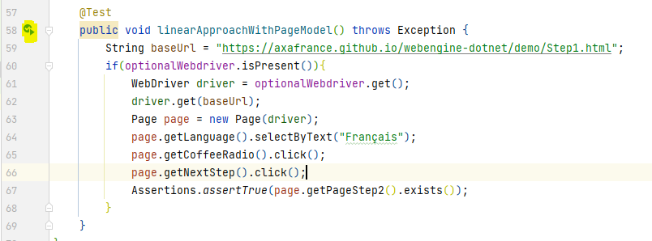
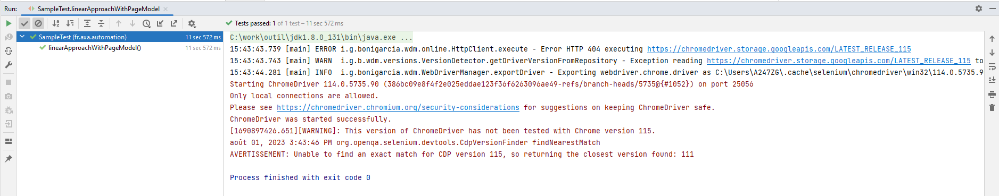

# Linear Scripting Approach (Java)
In this article we will show you how to write test cases using linear scripting approach.
Linear scripting approach is the most used approach in Unit Test and for simple test scenarios.
In this approach, test cases are interpreted directly into test scripts, the method is fast for writing simple test cases but does not guarantee reuse of the functionality and part of test script across test projects.

This tutorial is based on JUnit 5, if you are using TestNG, or another library, the solution will be similar.

> [!NOTE]
> Linear scripting approach is easy and fast to implement.
>
> Linear scripting approach does not guarantee modeling and reuse. Please consider avoiding this approach for end-to-end tests, because it may be too complex to be evolved and maintained.

## Required Framework components
* `webengine-web`: for Web Applications running on Desktop and Mobile Devices.

Other components of WebEngine Framework is not used.

## Steps to build Test Automation Solution using Linear Scripting

### Step 1: Prerequisites for linear Approach

JDK 8, maven and lombok

### Step 2: Create a Test Project

Create a simple maven project.

Open pom.xml paste below code 

```xml
<?xml version="1.0" encoding="UTF-8"?>
<project xmlns="http://maven.apache.org/POM/4.0.0" xmlns:xsi="http://www.w3.org/2001/XMLSchema-instance" xsi:schemaLocation="http://maven.apache.org/POM/4.0.0 http://maven.apache.org/xsd/maven-4.0.0.xsd">

    <modelVersion>4.0.0</modelVersion>

    <groupId>fr.axa.automation</groupId>
    <artifactId>sample-test-linear</artifactId>
    <version>1.0.0-SNAPSHOT</version>
    <packaging>jar</packaging>
    <name>sample-test-linear</name>

    <properties>
        <project.build.sourceEncoding>UTF-8</project.build.sourceEncoding>
    </properties>

    <dependencies>
        <dependency>
            <groupId>fr.axa.automation.webengine</groupId>
            <artifactId>webengine-web</artifactId>
            <version>2.2.0</version>
        </dependency>
    </dependencies>

    <build>
        <plugins>
            <plugin>
                <groupId>org.apache.maven.plugins</groupId>
                <artifactId>maven-compiler-plugin</artifactId>
                <version>3.10.1</version>
                <configuration>
                    <source>8</source>
                    <target>8</target>
                </configuration>
            </plugin>

            <plugin>
                <groupId>org.apache.maven.plugins</groupId>
                <artifactId>maven-surefire-plugin</artifactId>
                <version>3.0.0-M7</version>
                <configuration>
                    <useSystemClassLoader>false</useSystemClassLoader>
                </configuration>
            </plugin>

            <plugin>
                <groupId>org.jacoco</groupId>
                <artifactId>jacoco-maven-plugin</artifactId>
                <version>0.8.6</version>
            </plugin>

        </plugins>
        <pluginManagement>
            <plugins />
        </pluginManagement>
    </build>
</project>
```
Now we can build you project with the command "mvn clean install -U". 

Our system under test is the application: http://webengine-test.azurewebsites.net/Step1.html

### Step 3: Write Setup and Teardown
In this step, we will write `Setup` and `Teardown` functions to initialize test environment before each test case and cleanup the test results after each test case.

* Setup: Initializes the WebDriver object.
* Teardown: Closes the driver and the browser.

To do this, insert following code to `SampleTest.java`
```java
public class SampleTest {

    private Optional<WebDriver> optionalWebdriver;

    @BeforeEach // setup()
    public void setup() throws Exception {
        optionalWebdriver =  BrowserFactory.getWebDriver("Windows", "Chrome", Arrays.asList("--remote-allow-origins=*"));
    }

    @AfterEach
    void tearDown() {
        WebDriver driver = optionalWebdriver.get();
        driver.quit();
    }
    
}

```

### Step 4: Observe SUT and identify UI Elements

Observing system under test from Developer tools provided with browser. Here in our tutorial, we will operate 3 elements, to benefits the advantages from the Framework, we will put these 3 elements into a `PageModel`.


When identifying an UI Element, we can combine multiple locators to make sure they can select only the element we want:

* The dropdown list "Choose Language" can be identified by `TagName = "select"` and `id="language"`.
* The radio button group "Choose to buy" can be identified by `name="fav_language"` which matches all 3 radio buttons in the same group.
* The button "Next" can be identified by the `TagName="button"` and `onclick attribute="testSleep()"`

The PageModel for this web page can be coded like following snippet:
[!code-csharp[Main](../../Samples.LinearScripting/MyPageModel.cs "Page Model")]


### Step 5: Write test script.
Now we are ready to write the automated test script for this web page:
* Initialize the page model object
* Use the page model to interact with UI elements

Instead of using native selenium commands, it is recommended to use actions implemented in `WebElementDescription`. The script will be easier to read, to understand and to maintain, because
most of actions are protected for web page changes such as page reload or asynchronized JavaScript. Without the pattern, script may encounter `NoSuchElementException` and `StaleElementReferenceException`.

Using PageModel, you can fill the function TestMethod1 with following code snippet

```java
package fr.axa.automation.feature.model;

import fr.axa.automation.webengine.core.AbstractPageModel;
import fr.axa.automation.webengine.core.WebElementDescription;
import lombok.AccessLevel;
import lombok.Getter;
import lombok.experimental.FieldDefaults;
import org.openqa.selenium.WebDriver;


@FieldDefaults(level = AccessLevel.PUBLIC)
public class FirstPageModel extends AbstractPageModel {

    @Getter
    WebElementDescription language = WebElementDescription.builder().tagName("select").id("language").build();

    @Getter
    WebElementDescription coffeeRadio = WebElementDescription.builder().tagName("input").id("coffee").build();

    @Getter
    WebElementDescription teaRadio = WebElementDescription.builder().tagName("input").id("tea").build();

    @Getter
    WebElementDescription waterRadio = WebElementDescription.builder().tagName("input").id("water").build();

    @Getter
    WebElementDescription nextStep = WebElementDescription.builder().tagName("button").xPath(".//button[contains(text(),\"Next (3-second-delay)\")]").build();

    public FirstPageModel(WebDriver webDriver) throws Exception {
        populateDriver(webDriver);
    }
}
```


```java
public class SampleTest {

    private Optional<WebDriver> optionalWebdriver;

    @BeforeEach
    public void setup() throws Exception {
        optionalWebdriver =  BrowserFactory.getWebDriver("Windows", "Chrome", Arrays.asList("--remote-allow-origins=*"));
    }

    @AfterEach
    void tearDown() {
        WebDriver driver = optionalWebdriver.get();
        driver.quit();
    }

    @Test
    public void linearApproachWithPageModel() throws Exception {
        String baseUrl = "https://axafrance.github.io/webengine-dotnet/demo/Step1.html";
        if(optionalWebdriver.isPresent()){
            WebDriver driver = optionalWebdriver.get();
            driver.get(baseUrl);
            Page page = new Page(driver);
            page.getLanguage().selectByText("Français");
            page.getCoffeeRadio().click();
            page.getNextStep().click();
            Assertions.assertTrue(page.getPageStep2().exists());
        }
    }
}

```

### Step 6: Run tests
To run the test case, click to the play button:


Below the result



### Step 7: Improve the test cases
Now you can continue automatizing this scenario to the end by:
* Adding new UI elements into `PageModel`
* Manipulate these UI elements
* Retrieve information from these UI elements in order to compare with expected value

> [!NOTE]
> The source code of this exercise can be found in our Github repository.
> Project Name: sample-test-linear
> https://github.com/AxaFrance/webengine-java/sample-test-linear

