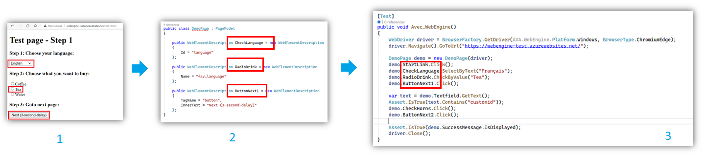
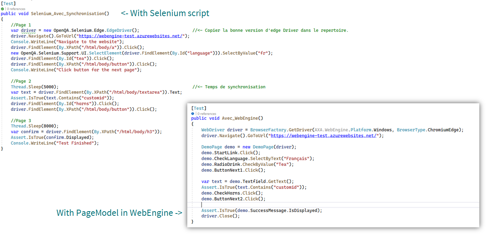

# Organize UI Elements With PageModel

We have already discussed the use of PageModels in the article [Test Web Application](../articles/webengine-web.md).
This article shows you how to use it in test automation activites.

> [!NOTE]
> PageModel applies both on Web Testing and Mobile App Testing.

## Common steps of automation
Before writing test scripts, we need to observe the Application under test to analyze the UI Elements which will be used during the test.
According to test approach and how test scenario will be organized (for example into actions by applying keyword-driven testing),
We can put one or more UI elements into a PageModel.

The general steps are shown as follow:

* `Step 1`: Identify the elements which will be interacted during the test.
* `Step 2`: Write a class inherated from PageModel and with <xref:AxaFrance.WebEngine.Web.WebElementDescription> or <xref:AXA.WebEngine.MobileApp.AppElementDescription>
* `Step 3`: Instantiate PageModels in the script and use above elements to perform different actions.

### Advantages of Page Models and Element Descriptions
1. By separating object identification and the test script itself, scripts are easier to read and to understand.
2. In case of non-functional changes to the UI, there is no need to change the test script.
Only update Web Element descriptions will be enough.
3. Every interaction via WelElement has `Retry` pattern natively implemented.
There is no need to implement time wait and synchronization in most of cases.

Finally, you can observe the difference between native selenium script and WebEngine based script:

