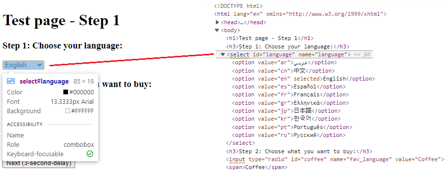
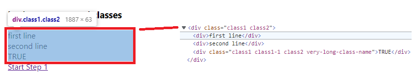
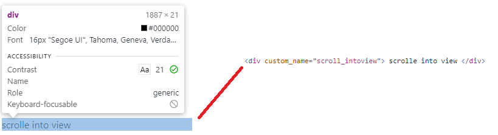
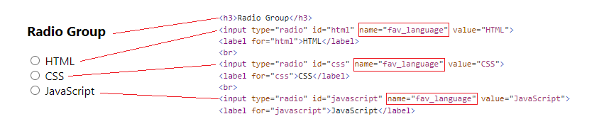

# Identify Web Elements
To identify Web Elements on a web page, you can use any combination of locators provided by the Framework, and the framework will find the right Web Element.


## Use WebElementDescription
Use <xref:AxaFrance.WebEngine.Web.WebElementDescription> is the easiest way to locate Web Elements and interact with it.
To identify an Element, you can use following identification strategy:
* `ClassName`: equivalent to html attribute **class**. class name can contain spaces.
* `CssSelector`: use Css Selector to locate the Web Element.
* `Id`: equivalent to html attribute **id**
* `InnerText`: The text within the html tag.
* `LinkText`: The text within a html hyperlink. (usually in tag **a**)
* `Name`: equivalent to html attribute **name**
* `TagName`: the name of the html tag. ex: *div*, *a*, *input*, ...
* `XPath`: use XPath to locate the Web Element/
* `Attributes`: any standard or non-standard html attributes.


## Identify Single Web Elements
First step to identify a Web Element on a HTML page is to use the `Developer Tools` integrated with the browser.
To open the Developer Tools on the Browser, you can do right-click on the web page and select `Inspect`, or press `F12` to activate it.

Then activate the Inspect function and move to the element to be manipulated by the test script.


For example: a dropdown list as shown below:


### Identify well tagged elements
On the HTML code shown, we can see it's an element with `select` tag and some attributes like `id` and `name`.
To identify this element, the locator `Id` is enough to identify this element:

```csharp
//Identify element with Id
var SelectLanguage = new WebElementDescription(driver)
{
    Id = "language"
};

//Select an option by value attribute
SelectLanguage.SelectByValue("fr");
//Or Select an option by displayed text
SelectLanguage.SelectByText("Français");
```

### Identify elements with multiple locators
It is strongly recommended that Developpers and Testers team work together to improve the testability of the application under test. That is tag UI elements so that can be easily identified by test script. 
But sometimes, it's not easy to have well tagged element for testers. To address issue, WebEngine Framework simplifies the way to identify Web Elements with multiple locator:

For example, to identify the following `div` element, there is no `id` nor `name`. But we can identify this element by its `TagName` and `Class`.


```csharp
//Identify element with multiple locators
var SelectLanguage = new WebElementDescription(driver)
{
    TagName = "div",
    ClassName = "class1 class2"
};
```

WebEngine framework will filter elements from DOM, by the Tag Name, then by the Class Name.
If necessary, you can use any combination of locators provided by the framework to identify elements

### Identify elements with non-standard HTML attributes
Sometimes (especially when the Web UI is composed by javascript frameworks) element has no explorable locators natively supported.
For example: following `button` element has no `id`, `name`, nor `class` or other standard HTML attributes.


To identify this element, we can use `HtmlAttribute` locator.

```csharp
var customDiv = new WebElementDescription(driver)
{
    Attributes = new HtmlAttribute[]
    {
        new HtmlAttribute("custom_name", "scroll_intoview"),
    }
};
```
With HTML attributes locator, you can literly identify any elements in HTML. Choose the combination of easiest and most stable locator is a key to keep your script maintainable.


## Identify Multiple Web Elements
With above locators, you can identify an unique Web Element to interact with.

But sometimes, you'll also need to identify multiple elements, for example to populate items from a list, to get all radio button options. To identify multiple Web Elements, you'll use exactly the same method.

As below example, we want to identify the available options of the radio button group (which all options share the same `name`).


We can use following method to identify these radio group and perform `CheckByValue` to select the CSS option.
```csharp
var radioGroup = new WebElementDescription(driver)
{
    Name = "fav_language"
};

//Checks the option where value="CSS"
var check = radioGroup.CheckByValue("CSS");  

//Find all elements matches the current description (populates IWebElement of 3 options)
var elements = radioGroup.FindElements(); 
```

> [!WARNING]
> When the element description matches multiple elements,
> calling methods expected on single element like `Click()` or `SetValue()` will throw InvalidSelectorException.

